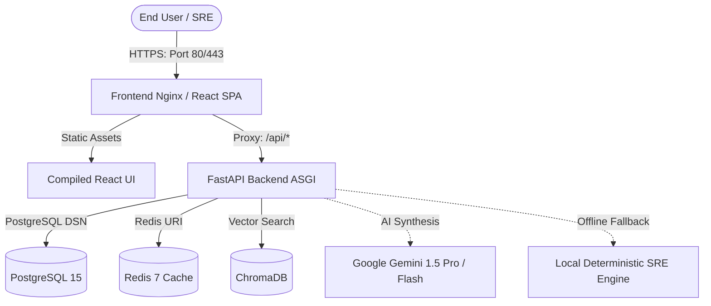

# CloudPulse-AI — Enterprise Deployment & Operations Guide

This guide provides end-to-end instructions for deploying CloudPulse-AI in local development, containerized demo mode, and high-availability production environments.

---

## 1. Architecture Overview



---

## 2. Prerequisites

| Requirement | Minimum Version | Notes |
| :--- | :--- | :--- |
| **Docker Engine** | 24.0+ | Required for containerized runtime |
| **Docker Compose** | v2.20+ | Included in Docker Desktop |
| **Node.js** | 20.x LTS | For local frontend development |
| **Python** | 3.11 or 3.12 | For local backend development |
| **PostgreSQL** | 15+ | Optional if using Docker Compose |
| **Redis** | 7+ | Optional if using Docker Compose |

---

## 3. Quick Start (One-Command Launch)

### Step 1: Clone and Configure
```bash
git clone https://github.com/NaniToka/CloudPulse-AI.git
cd CloudPulse-AI
cp .env.example .env
```

### Step 2: Launch with Docker Compose
```bash
docker compose up --build -d
```

### Step 3: Access CloudPulse-AI Services
- **Frontend Dashboard**: [http://localhost:5173](http://localhost:5173) (or [http://localhost:80](http://localhost:80))
- **Backend API Docs**: [http://localhost:8000/docs](http://localhost:8000/docs)
- **Health Probe**: [http://localhost:8000/health](http://localhost:8000/health)
- **Readiness Probe**: [http://localhost:8000/ready](http://localhost:8000/ready)
- **Default Credentials**: `admin@cloudpulse.io` / `Password123!`

---

## 4. Containerized DEMO MODE

CloudPulse-AI comes out-of-the-box with **DEMO MODE** enabled (`DEMO_MODE=true`). In this mode:
- Live cloud credentials (AWS/Azure/GCP) are **not required**.
- The backend automatically seeds high-fidelity sample telemetry across 2,847 simulated servers.
- AI Log Analysis uses a deterministic local SRE engine to parse logs, cluster errors, and compute root cause diagnostics without external Gemini API keys.
- Cost Optimizer loads full FinOps spend breakdowns and actionable recommendations.
- RAG AI Chat queries retrieve grounded telemetry context from local vector memory.

To enable live Gemini AI, simply set:
```ini
GEMINI_API_KEY=your_actual_gemini_api_key
DEMO_MODE=false
```

---

## 5. Local Development (Without Docker)

### Backend Setup
```bash
cd backend
python -m venv venv
source venv/bin/activate
pip install --upgrade pip
pip install -r requirements.txt

# Run database migrations and start server
uvicorn app.main:app --host 0.0.0.0 --port 8000 --reload
```

### Frontend Setup
```bash
cd frontend
npm ci
npm run dev
```

---

## 6. Environment Variables Reference

| Variable | Default Value | Description |
| :--- | :--- | :--- |
| `APP_ENV` | `development` | Environment mode (`development`, `demo`, `production`) |
| `DEMO_MODE` | `true` | When true, enables local synthetic datasets & deterministic AI |
| `DATABASE_URL` | `postgresql+asyncpg://...` | Async PostgreSQL connection string |
| `SECRET_KEY` | *(Random 32-byte hex)* | Secret key used for cryptographic JWT signing |
| `CORS_ORIGINS` | `http://localhost:5173` | Comma-separated or JSON list of allowed origins |
| `REDIS_URL` | `redis://redis:6379/0` | Redis caching connection string |
| `CHROMA_HOST` | `chromadb` | Vector database hostname |
| `GEMINI_API_KEY` | `""` | Optional Google Gemini AI API key |

---

## 7. Production Hardening Checklist

When deploying CloudPulse-AI to production:
1. **Generate Cryptographic Keys**:
   ```bash
   openssl rand -hex 32
   ```
   Assign the result to `SECRET_KEY` and `JWT_SECRET_KEY` in `.env.production`.
2. **Restrict CORS Origins**:
   Ensure `CORS_ORIGINS` only lists your verified frontend domain (e.g., `https://app.cloudpulse.io`).
3. **Database Passwords**:
   Replace `change_me_in_production` with a strong, rotated PostgreSQL password.
4. **ASGI Workers**:
   The production `backend/Dockerfile` runs `uvicorn app.main:app --workers 2 --no-access-log`. Adjust `--workers` based on CPU cores (`(2 x cores) + 1`).
5. **Nginx Security**:
   The frontend Nginx container enforces HSTS, X-Frame-Options DENY, X-Content-Type-Options nosniff, and SPA fallback routing.

---

## 8. Health, Readiness & Observability Probes

CloudPulse-AI exposes structured Kubernetes-compatible health probes:

### Liveness Probe (`GET /health`)
```json
{
  "status": "ok",
  "app": "CloudPulse AI",
  "version": "1.0.0",
  "env": "production",
  "dependencies": {
    "database": "healthy",
    "redis": "healthy",
    "ai": "gemini-cloud-ai"
  }
}
```

### Readiness Probe (`GET /ready`)
```json
{
  "status": "ready",
  "timestamp": 1786380450.12,
  "dependencies": {
    "database": "healthy",
    "redis": "healthy",
    "ai": "available"
  }
}
```

---

## 9. Troubleshooting & Operations

### View Container Logs
```bash
# View backend logs
docker compose logs -f backend

# View frontend access & error logs
docker compose logs -f frontend

# View database logs
docker compose logs -f postgres
```

### Reset / Reinitialize Database
```bash
docker compose down -v
docker compose up --build -d
```

### Rollback Strategy
If a deployment fails:
```bash
docker compose -f docker-compose.yml down
git checkout <previous_stable_commit>
docker compose up --build -d
```
