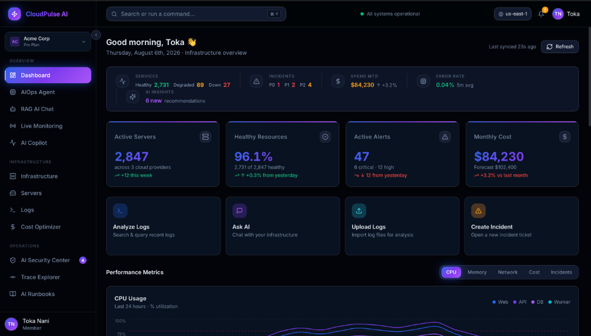
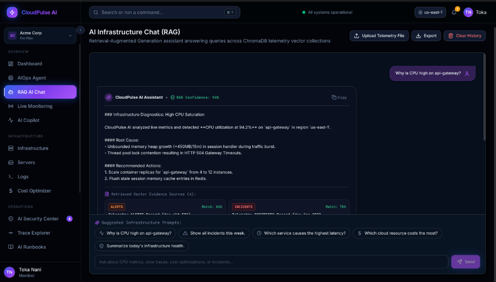
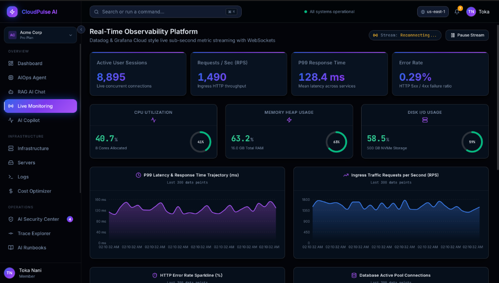
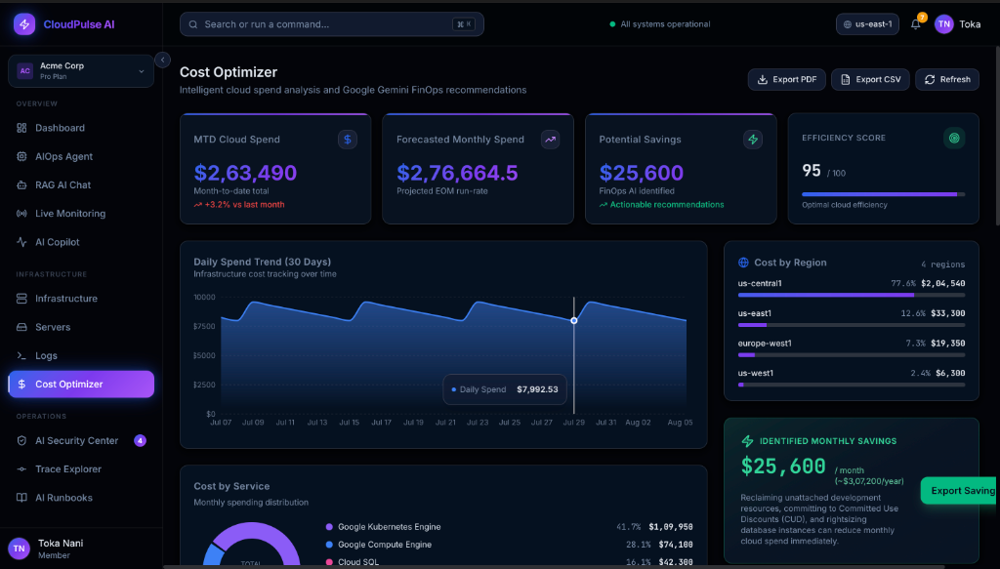
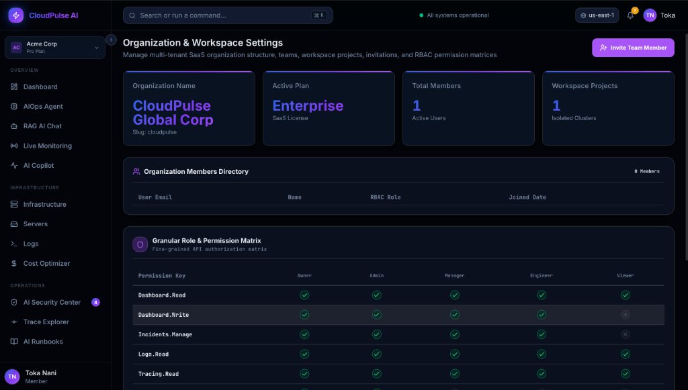
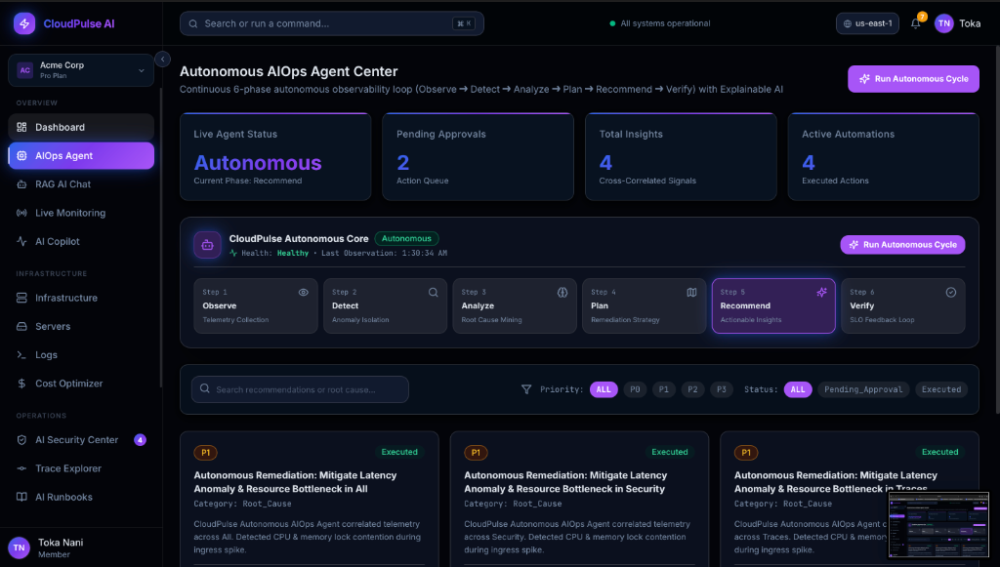
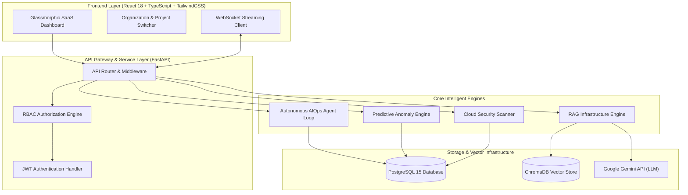
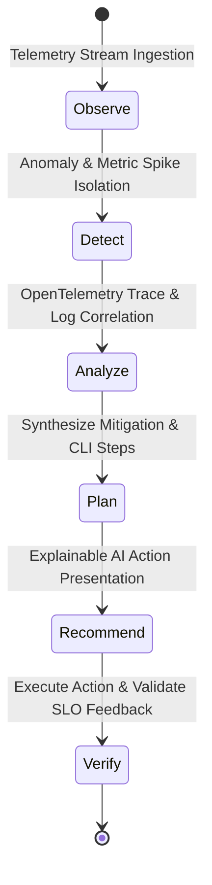
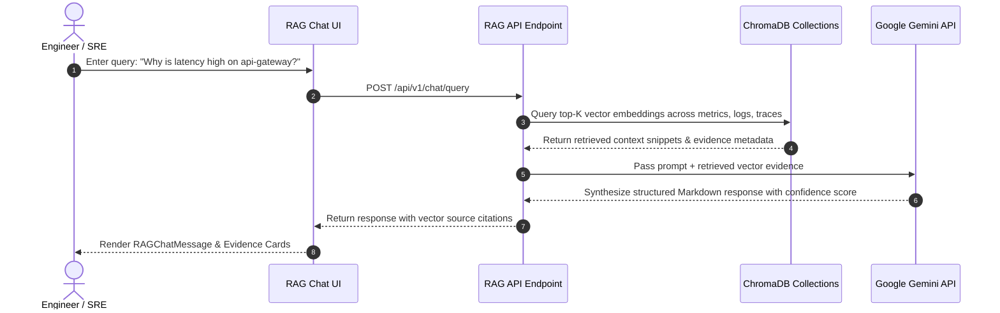

<p align="center">
  
</p>

<p align="center">
  <a href="https://python.org"></a>
  <a href="https://fastapi.tiangolo.com"></a>
  <a href="https://react.dev"></a>
  <a href="https://typescriptlang.org"></a>
  <a href="https://tailwindcss.com"></a>
  <a href="https://docker.com"></a>
  <a href="https://postgresql.org"></a>
  <a href="https://opentelemetry.io"></a>
  <a href="https://ai.google.dev"></a>
  <a href="https://jwt.io"></a>
  <a href="LICENSE"></a>
</p>

<p align="center">
  <a href="https://github.com/NaniToka/CloudPulse-AI/stargazers"></a>
  <a href="https://github.com/NaniToka/CloudPulse-AI/network/members"></a>
  <a href="https://github.com/NaniToka/CloudPulse-AI/issues"></a>
  <a href="https://github.com/NaniToka/CloudPulse-AI/pulls"></a>
  <a href="https://github.com/NaniToka/CloudPulse-AI/commits/main"></a>
  <a href="https://github.com/NaniToka/CloudPulse-AI/actions"></a>
  <a href="https://codecov.io/gh/NaniToka/CloudPulse-AI"></a>
</p>

<p align="center">
  <a href="https://github.com/NaniToka/CloudPulse-AI"></a>
  <a href="http://localhost:5173"></a>
  <a href="#-documentation"></a>
  <a href="https://github.com/NaniToka/CloudPulse-AI/issues"></a>
  <a href="https://github.com/NaniToka/CloudPulse-AI/discussions"></a>
</p>

---

## 🌟 Executive Overview

**CloudPulse AI** is a next-generation, enterprise-grade **Autonomous Cloud Observability and AIOps Platform**. Built to solve the complexity of multi-cloud Kubernetes clusters, distributed microservices, and hybrid cloud infrastructures, CloudPulse AI transforms reactive monitoring into **autonomous incident detection, prediction, root-cause analysis, and self-healing auto-remediation**.

Inspired by industry benchmarks like **Google Cloud Operations (Stackdriver)**, **Datadog Watchdog**, **Dynatrace Davis AI**, and **Wiz Security**, CloudPulse AI integrates Google Gemini API with RAG (Retrieval-Augmented Generation), OpenTelemetry distributed tracing, sub-second WebSockets metric streaming, and fine-grained multi-tenant RBAC authorization into a single glassmorphic control plane.

---

## 🔴 Problem vs. 🟢 Solution

| 🔴 Traditional Observability Pain Points | 🟢 CloudPulse AI Autonomous Solution |
| :--- | :--- |
| **Alert Fatigue**: Thousands of un-correlated alerts flooding SRE PagerDuty on-call channels. | **Autonomous Event Correlation**: Gemini AI groups related telemetry across logs, traces, and metrics into unified root cause insights. |
| **Manual Root Cause Diagnostics**: SREs waste hours jumping across disconnected log searchers and APM dashboards. | **Instant RAG Infrastructure Diagnostics**: Query your cluster telemetry in natural language with ChromaDB vector context. |
| **Reactive Incident Response**: Engineers fix outages *after* customer impact occurs. | **Predictive Anomaly Detection**: ML time-series forecasting detects CPU, memory, and disk bottlenecks before failure. |
| **Static Manual Runbooks**: Outdated wiki pages requiring manual shell execution. | **AI Runbook Generator & Auto Remediation**: Automated execution plans with safe human-in-the-loop CLI action approvals. |
| **Unbounded Cloud Costs**: Surprise AWS/GCP bills from idle instances and unindexed DB joins. | **AI FinOps Optimizer**: Continuous cloud cost tracking, monthly run-rate forecasting, and automated right-sizing. |
| **Data Leakage in Multi-Tenant Environments**: Weak authorization rules leaking cross-department data. | **Enterprise Multi-Tenant Isolation**: Strict Organization, Team, and Project scoping with granular RBAC permissions. |

---

## ⚡ Core Enterprise Capabilities

### 🤖 1. Autonomous AIOps Agent Center
- Continuous **6-phase autonomous observability loop**: `Observe ➔ Detect ➔ Analyze ➔ Plan ➔ Recommend ➔ Verify`.
- Human-in-the-loop explainable AI action approval drawer with confidence scoring and CLI remediation candidates.

### 💬 2. AI Infrastructure Chat (RAG)
- Vector-indexed Retrieval-Augmented Generation querying 6 ChromaDB collections (`metrics`, `logs`, `traces`, `incidents`, `alerts`, `cost`).
- Answers complex SRE queries with exact vector evidence citations.

### 🛡️ 3. AI Security & Cloud Compliance Center
- 9 automated cloud security domain scanners evaluating CIS Benchmarks, ISO 27001, SOC 2, NIST, PCI-DSS, HIPAA, and GDPR.
- Provider x Severity Risk Heatmap matrix and Wiz-style threat detail modal.

### 📖 4. AI Runbook Generator & Auto Remediation Center
- Automatically generates executable mitigation runbooks with Kubernetes, CLI, and Terraform action steps.
- Live execution stream audit logs.

### 🔭 5. Distributed Tracing Platform (OpenTelemetry)
- Full request cascade visualization (`Load Balancer ➔ Gateway ➔ Auth ➔ App ➔ Cache ➔ Database`).
- Microservice Dependency Maps and P99 latency waterfall charts.

### 📊 6. Real-Time Observability Engine
- Datadog/Grafana style sub-second WebSockets metric streaming for CPU, Memory, Disk I/O, Network Throughput, RPS, and P99 response time.

### 🔮 7. Predictive Incident Detection Engine
- Time-series machine learning anomaly forecasting predicting outages 30+ minutes before occurrence.

### 💰 8. AI Cloud Cost Optimizer
- Intelligent cloud spend tracking across AWS, GCP, and Azure with automated FinOps recommendations.

### 📝 9. AI Log Analyzer
- Automated log parsing, root cause analysis, error clustering, and anomaly classification.

### 🚨 10. Incident Management Center
- PagerDuty-style incident lifecycle management with severity assignment, engineer routing, and AI post-mortems.

### 🏢 11. Multi-Tenant SaaS Architecture
- Organization, Team, and Project scoping with Granular RBAC Permissions (`Owner`, `Admin`, `Manager`, `Engineer`, `Viewer`) and Security Audit Trails.

---

## 🆚 Feature Comparison

| Capability | CloudPulse AI | Datadog | Dynatrace | Grafana Cloud | New Relic |
| :--- | :---: | :---: | :---: | :---: | :---: |
| **Autonomous 6-Phase AIOps Loop** | ✅ Included | ❌ Add-on | ⚠️ Partial | ❌ Manual | ⚠️ Partial |
| **Google Gemini RAG Vector Search** | ✅ Included | ❌ No | ❌ No | ❌ No | ❌ No |
| **Executable AI Runbooks & Auto-Fix** | ✅ Included | ⚠️ Manual | ⚠️ Manual | ❌ No | ❌ No |
| **OpenTelemetry Distributed Tracing** | ✅ Included | ✅ Included | ✅ Included | ✅ Included | ✅ Included |
| **Sub-Second WebSockets Streaming** | ✅ Included | ✅ Included | ✅ Included | ✅ Included | ✅ Included |
| **CSPM Cloud Security & Compliance** | ✅ 7 Frameworks | ⚠️ Add-on | ⚠️ Add-on | ❌ No | ❌ No |
| **Multi-Tenant RBAC & Audit Trails** | ✅ Included | ⚠️ Enterprise | ⚠️ Enterprise | ⚠️ Enterprise | ⚠️ Enterprise |
| **Self-Hosted Open Source (MIT)** | ✅ Free | ❌ SaaS Only | ❌ SaaS Only | ⚠️ Partial | ❌ SaaS Only |

---

## 📸 Screenshots Showcase

<div align="center">

### 🖥️ Executive Enterprise Dashboard

*Real-time cross-cloud health overview, active server counts, error rate sparklines, and AI insight highlights.*

### 🤖 Autonomous AIOps Agent Center

*Continuous 6-phase agent loop visualization, action queue, confidence scores, and automated CLI candidate execution.*

### 💬 AI Infrastructure Chat (RAG)

*Vector-augmented infrastructure assistant citing exact telemetry source context from ChromaDB vector collections.*

### 📊 Real-Time Observability Engine

*Sub-second WebSockets streaming telemetry for CPU, Memory Heap, Disk I/O, and P99 latency trajectory.*

### 💰 AI Cloud Cost Optimizer

*FinOps spend breakdown by region and service with monthly run-rate forecasting and instant savings recommendations.*

### 🏢 Organization & Multi-Tenant RBAC Settings

*Multi-tenant SaaS organization management, team directories, workspace project scoping, and granular RBAC capability matrix.*

</div>

---

## 📽️ Live Demo

<div align="center">
  
  <p><i>Live demonstration of CloudPulse AI Autonomous Observability & RAG Infrastructure Diagnostics.</i></p>
</div>

---

## 📐 Architecture Diagrams

### 🏗️ 1. Overall System Architecture



### 🔄 2. Autonomous AIOps Agent Loop



### 💬 3. RAG Infrastructure Chat Flow



---

## 🛠️ Technology Stack Matrix

| Category | Technology | Usage in CloudPulse AI |
| :--- | :--- | :--- |
| **Backend Core** | FastAPI | High-performance async Python web framework |
| **Database** | PostgreSQL 15 | Relational storage with SQLAlchemy AsyncSession |
| **Vector Store** | ChromaDB | Local vector embeddings database for telemetry RAG |
| **AI LLM Engine** | Google Gemini API | Structured reasoning, root cause analysis, & runbook synthesis |
| **Frontend Framework**| React 18 | Declarative UI with TypeScript & Vite build tool |
| **Styling** | TailwindCSS + shadcn/ui | Modern dark-mode glassmorphic component design system |
| **State & Query** | TanStack React Query + Zustand | Server state synchronization & global UI client state |
| **Live Telemetry** | WebSockets | Real-time sub-second metric streaming engine |
| **Tracing Standard** | OpenTelemetry | Distributed request tracing & APM span collection |
| **Containerization** | Docker & Docker Compose | Multi-container environment orchestration |

---

## 📂 Repository Directory Structure

```
CloudPulse-AI/
├── .github/
│   ├── ISSUE_TEMPLATE/
│   │   ├── bug_report.md
│   │   ├── feature_request.md
│   │   └── question.md
│   ├── workflows/
│   │   ├── ci-backend.yml
│   │   ├── ci-frontend.yml
│   │   ├── docker-build.yml
│   │   └── security-scan.yml
│   └── PULL_REQUEST_TEMPLATE.md
├── assets/
│   ├── screenshots/
│   └── demo.gif
├── backend/
│   ├── app/
│   │   ├── api/v1/endpoints/   # REST API Route Modules
│   │   ├── core/               # Security, Config, & RBAC Engine
│   │   ├── crud/               # Repository Pattern Classes
│   │   ├── db/                 # Database Base & Session
│   │   ├── models/             # SQLAlchemy ORM Models
│   │   ├── schemas/            # Pydantic v2 Schemas
│   │   └── services/           # Business Logic & AI Engines
│   ├── tests/                  # Pytest Unit & Integration Suite
│   ├── Dockerfile
│   └── requirements.txt
├── docs/
│   └── images/
├── frontend/
│   ├── src/
│   │   ├── components/         # React Component Modules
│   │   ├── pages/              # SaaS App View Pages
│   │   ├── services/           # Axios API Service Clients
│   │   └── types/              # TypeScript Definitions
│   ├── Dockerfile
│   └── package.json
├── CHANGELOG.md
├── CODE_OF_CONDUCT.md
├── CONTRIBUTING.md
├── docker-compose.yml
├── LICENSE
├── README.md
└── SECURITY.md
```

---

## 🚀 Quickstart & Installation

### Option 1: Docker Compose (Recommended)

1. **Clone the repository**:
   ```bash
   git clone https://github.com/NaniToka/CloudPulse-AI.git
   cd CloudPulse-AI
   ```

2. **Configure Environment Variables**:
   ```bash
   cp backend/.env.example backend/.env
   # Add your GEMINI_API_KEY in backend/.env
   ```

3. **Launch Container Services**:
   ```bash
   docker compose up --build
   ```

4. **Access the Application**:
   - 🌐 **Frontend App**: `http://localhost:5173`
   - ⚡ **Backend API**: `http://localhost:8000`
   - 📖 **Swagger OpenAPI Docs**: `http://localhost:8000/docs`

---

### Option 2: Production Docker Compose Deployment

```bash
# Launch the complete enterprise production stack with Prometheus & Grafana
docker compose -f docker-compose.production.yml up -d --build

# Verify healthy status
docker compose -f docker-compose.production.yml ps
```

- 🌐 **Production Frontend**: `http://localhost:80`
- ⚡ **Production API Backend**: `http://localhost:8000`
- 📊 **Prometheus Metrics**: `http://localhost:9090`
- 📈 **Grafana Observability**: `http://localhost:3000` (admin/admin)

---

### Option 3: Enterprise Kubernetes Deployment

All production Kubernetes manifests are configured in `deployment/kubernetes/`:

```bash
# 1. Create dedicated namespace
kubectl apply -f deployment/kubernetes/namespace.yaml

# 2. Deploy ConfigMaps and Secrets
kubectl apply -f deployment/kubernetes/configmap.yaml
kubectl apply -f deployment/kubernetes/secrets.yaml

# 3. Deploy Stateful Storage (PostgreSQL & Redis)
kubectl apply -f deployment/kubernetes/postgres-statefulset.yaml
kubectl apply -f deployment/kubernetes/redis-deployment.yaml

# 4. Deploy Services and Core Workloads
kubectl apply -f deployment/kubernetes/services.yaml
kubectl apply -f deployment/kubernetes/backend-deployment.yaml
kubectl apply -f deployment/kubernetes/frontend-deployment.yaml

# 5. Enable Ingress & Horizontal Pod Autoscaling (HPA)
kubectl apply -f deployment/kubernetes/ingress.yaml
kubectl apply -f deployment/kubernetes/hpa.yaml
```

---

## ⚙️ Environment Variables Reference

| Variable | Description | Default |
| :--- | :--- | :--- |
| `DATABASE_URL` | PostgreSQL asyncpg connection string | `postgresql+asyncpg://...` |
| `REDIS_URL` | Redis cache and blocklist URL | `redis://redis:6379/0` |
| `CHROMADB_HOST` | ChromaDB vector database host | `chromadb` |
| `SECRET_KEY` | JWT signing secret key (32 bytes) | `cloudpulse_production_secret_key` |
| `GEMINI_API_KEY` | Google Gemini API Key | `your_gemini_api_key_here` |
| `GEMINI_MODEL` | Gemini LLM model name | `gemini-1.5-flash` |
| `APP_ENV` | Environment mode (`production` / `development`) | `production` |

---

## 🛡️ CI/CD Quality Engineering

CloudPulse AI maintains a strict zero-compromise CI/CD quality gate policy across both backend and frontend repositories:

- **Automated Python Quality Gates**: Verified with [Ruff](https://astral.sh/ruff) enforcing PEP 604 union types (`X | None`), modern Python 3.11+ builtins (`list`, `dict`, `tuple`), sorted imports, and strict datetime standards (`datetime.UTC`).
- **Full Async Test Suite**: 95+ asynchronous integration and unit tests running against live PostgreSQL, Redis, and ChromaDB via pytest & AnyIO.
- **Frontend Type Safety**: Strict TypeScript compiler checks (`tsc --noEmit`) and optimized production bundling via Vite.
- **Security Scanners**: Bandit static analysis, Safety dependency vulnerability scanning, npm audit, and Trivy container scans in `.github/workflows/`.
- **Container Health Verification**: Docker Compose and Kubernetes readiness/liveness probes (`/health`, `/ready`, `/metrics`).

---

## 🔒 Security, Performance & Benchmarks

- **Security Model**: Strict Pydantic v2 payload validation, passlib PBKDF2 password hashing, JWT refresh token rotation with Redis blocklist, role-based access control (`Owner`, `Admin`, `Manager`, `Engineer`, `Viewer`), and CSP / HSTS security headers middleware.
- **Observability**: Prometheus text exposition at `/metrics`, OpenTelemetry distributed trace context propagation (`traceparent`), and real-time WebSocket metric streaming.
- **Scalability**: Stateless FastAPI horizontal scaling with Gunicorn/Uvicorn, Kubernetes HPA scaling 2-10 replicas, and isolated PostgreSQL tenant schemas.

---

## 🗺️ Project Roadmap

| Phase | Milestone | Status |
| :--- | :--- | :---: |
| **Phase 1** | Core Auth, Dashboard, Real-Time WebSockets, AI Copilot | ✅ Completed |
| **Phase 2** | AI Log Analyzer, Predictive Incident Detection, Cost Optimizer | ✅ Completed |
| **Phase 3** | OpenTelemetry Tracing, RAG Infrastructure Chat, AI Runbooks | ✅ Completed |
| **Phase 4** | AI Security & Cloud Compliance Center, Autonomous AIOps Agent | ✅ Completed |
| **Phase 5** | Multi-Tenant Enterprise SaaS Architecture & Granular RBAC | ✅ Completed |
| **Phase 6** | Digital Twin Infrastructure Simulation & Chaos Blast-Radius Modeling | ✅ Completed |
| **Phase 7** | Production Hardening, Kubernetes Manifests & GitHub Actions CI/CD | ✅ Completed |

---

## 🤝 Contributing

We welcome open-source contributions! Please review our [Contributing Guide](CONTRIBUTING.md) and [Code of Conduct](CODE_OF_CONDUCT.md) before submitting Pull Requests.

---

## 📄 License

This project is licensed under the **MIT License** - see the [LICENSE](LICENSE) file for details.

---

<p align="center">
  <sub>Built with ❤️ by the CloudPulse AI Team • Powered by Google Gemini & OpenTelemetry</sub>
</p>
