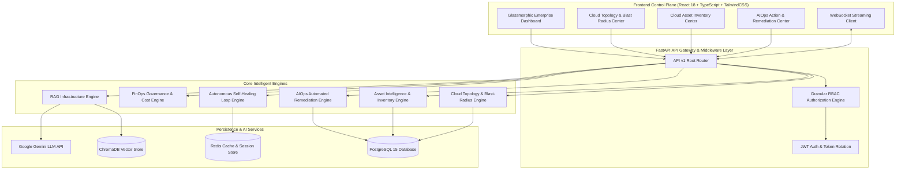

<p align="center">
  
</p>

<p align="center">
  <a href="https://python.org"></a>
  <a href="https://fastapi.tiangolo.com"></a>
  <a href="https://react.dev"></a>
  <a href="https://typescriptlang.org"></a>
  <a href="https://tailwindcss.com"></a>
  <a href="https://docker.com"></a>
  <a href="https://postgresql.org"></a>
  <a href="https://opentelemetry.io"></a>
  <a href="https://ai.google.dev"></a>
  <a href="https://jwt.io"></a>
  <a href="LICENSE"></a>
</p>

<p align="center">
  <a href="https://github.com/NaniToka/CloudPulse-AI/stargazers"></a>
  <a href="https://github.com/NaniToka/CloudPulse-AI/network/members"></a>
  <a href="https://github.com/NaniToka/CloudPulse-AI/issues"></a>
  <a href="https://github.com/NaniToka/CloudPulse-AI/pulls"></a>
  <a href="https://github.com/NaniToka/CloudPulse-AI/commits/main"></a>
  <a href="https://github.com/NaniToka/CloudPulse-AI/actions"></a>
  <a href="https://codecov.io/gh/NaniToka/CloudPulse-AI"></a>
</p>

<p align="center">
  <a href="https://github.com/NaniToka/CloudPulse-AI"></a>
  <a href="http://localhost:5173"></a>
  <a href="#-documentation"></a>
  <a href="https://github.com/NaniToka/CloudPulse-AI/issues"></a>
  <a href="https://github.com/NaniToka/CloudPulse-AI/discussions"></a>
</p>

---

## 🌟 Executive Overview

**CloudPulse AI** is an enterprise-grade **Autonomous Cloud Operations, Observability, FinOps Governance, and AIOps Platform**. Designed to resolve the extreme operational complexity of multi-cloud Kubernetes clusters, distributed microservices, and multi-region cloud environments, CloudPulse AI converts reactive monitoring into **autonomous incident detection, predictive anomaly forecasting, root-cause analysis, blast-radius calculation, and self-healing auto-remediation**.

Inspired by industry benchmarks including **Google Cloud Operations (Stackdriver)**, **Datadog Watchdog**, **Dynatrace Davis AI**, and **Wiz CSPM**, CloudPulse AI integrates Google Gemini LLM reasoning with Retrieval-Augmented Generation (RAG), OpenTelemetry distributed tracing, sub-second WebSockets streaming, and fine-grained multi-tenant RBAC into a unified glassmorphic platform.

---

## 🔴 Problem vs. 🟢 Solution

| 🔴 Traditional Observability Pain Points | 🟢 CloudPulse AI Autonomous Solution |
| :--- | :--- |
| **Alert Fatigue**: Thousands of un-correlated alerts flooding SRE PagerDuty on-call channels. | **Autonomous Event Correlation**: Gemini AI groups related telemetry across logs, traces, and metrics into unified root-cause insights. |
| **Manual Root Cause Diagnostics**: SREs waste hours jumping across disconnected log searchers and APM dashboards. | **Instant RAG Infrastructure Diagnostics**: Query cluster telemetry in natural language with vector-indexed evidence citations. |
| **Reactive Incident Response**: Engineers fix outages *after* customer impact occurs. | **Predictive Anomaly Detection**: Time-series forecasting predicts CPU, memory, disk, and SLO failures 30+ minutes ahead. |
| **Static Manual Runbooks**: Outdated wiki pages requiring manual shell execution. | **AI Runbook Generator & Auto Remediation**: Production remediation engine supporting Automated, Semi-Automated, and Manual workflows with safe rollback. |
| **Unbounded Cloud Costs**: Surprise AWS/GCP bills from idle instances and unattached storage. | **Enterprise FinOps Governance Center**: Continuous cloud spend tracking, budget enforcement, cost violation detection, and automated remediation. |
| **Blind Spots in Blast Radius**: Engineers cannot predict which services break during a resource outage. | **Cloud Topology & Blast-Radius Engine**: Multi-cloud dependency graph, topological blast radius calculation, Single Point of Failure (SPOF) detection, and failure simulation. |
| **Data Leakage in Multi-Tenant Environments**: Weak authorization rules leaking cross-department data. | **Enterprise Multi-Tenant Isolation**: Strict Organization, Team, and Project scoping with granular RBAC permissions and security audit logs. |

---

## ⚡ Core Enterprise Capabilities

### 🌐 1. Enterprise Cloud Topology & Blast-Radius Center (`/topology`)
- Multi-cloud infrastructure dependency graph (AWS, Azure, GCP, Kubernetes).
- Deterministic topological blast-radius calculation (`CRITICAL`, `HIGH`, `MEDIUM`, `LOW`).
- Single Points of Failure (SPOF) detection across databases, load balancers, regions, and clusters.
- Interactive failure propagation simulation (`simulate_failure`) with `"SIMULATION ONLY"` safety guards.
- Dependency path latency analysis with real telemetry fallback (`"Telemetry unavailable"`).

### 📦 2. Enterprise Cloud Asset Intelligence & Resource Inventory (`/assets`)
- Unified multi-cloud resource inventory tracking provider, service, region, environment, status, metrics, and monthly cost.
- Resource lifecycle state classification (`ACTIVE`, `IDLE`, `DEGRADED`, `ORPHANED`, `DECOMMISSIONED`).
- Unattached storage and idle compute waste detection with potential savings calculations.
- Integrated security vulnerability risk scores and governance compliance statuses.

### 👔 3. Executive Cloud Operations Command Center (`/command-center`)
- Executive-level observability layer providing unified health scores, financial risk burn metrics, operational risk indices, and SLA summaries.
- Single-click executive snapshot history and AI-synthesized strategic recommendations.

### 🔄 4. Autonomous Cloud Operations & Self-Healing Center (`/autonomous`)
- Fully autonomous closed-loop self-healing engine (`Observe ➔ Detect ➔ Analyze ➔ Plan ➔ Execute ➔ Verify`).
- Policy-driven multi-tier autonomy safety controls (`AUTOMATED`, `SEMI_AUTOMATED`, `MANUAL`).
- Automated rollback triggers, execution lock management, and maintenance window enforcement.

### 🎯 5. Enterprise Service Reliability Engine & SLO Intelligence 2.0 (`/reliability`)
- Real end-to-end SLI/SLO measurement across availability, latency, error rate, and throughput.
- Error budget burn-rate tracking, exhaustion forecasting, and automated policy enforcement.

### ⚡ 6. Enterprise AIOps Automated Remediation & Action Center (`/remediation`)
- Production-grade remediation plan synthesis for incidents, cost anomalies, security findings, and SLO violations.
- Multi-stage approval workflows, dry-run validation, execution logging, and 1-click rollbacks.

### 💰 7. Enterprise FinOps Governance & Cost Control Center (`/finops/governance`)
- Multi-cloud cost policy enforcement, cost anomaly detection, real-time budget violation alerts, and automated right-sizing.

### 🛡️ 8. Enterprise Cloud Governance & Compliance Center (`/governance`)
- Cross-cloud compliance posture evaluation across 7 security frameworks (CIS Benchmarks, ISO 27001, SOC 2, NIST, PCI-DSS, HIPAA, GDPR).
- Automated policy drift detection and remediation step generation.

### 🤖 9. Autonomous AIOps Agent Center (`/aiops`)
- Continuous 6-phase autonomous observability loop with explainable AI recommendation drawers.

### 💬 10. AI Infrastructure Chat (RAG) (`/chat`)
- Vector-indexed RAG querying 6 ChromaDB collections (`metrics`, `logs`, `traces`, `incidents`, `alerts`, `cost`) with exact evidence citations.

### 🔭 11. Distributed Tracing Platform (OpenTelemetry) (`/tracing`)
- End-to-end trace waterfall charts (`Load Balancer ➔ Gateway ➔ Auth ➔ Service ➔ Database`).

### 📊 12. Real-Time Observability Engine (`/monitoring`)
- Sub-second WebSockets metric streaming for CPU, Memory, Disk I/O, Network Throughput, RPS, and P99 latency.

---

## 🆚 Feature Comparison

| Capability | CloudPulse AI | Datadog | Dynatrace | Grafana Cloud | New Relic |
| :--- | :---: | :---: | :---: | :---: | :---: |
| **Autonomous Self-Healing Loop** | ✅ Included | ❌ Add-on | ⚠️ Partial | ❌ Manual | ⚠️ Partial |
| **Multi-Cloud Topology & Blast Radius** | ✅ Included | ⚠️ Paid | ⚠️ Paid | ❌ No | ⚠️ Paid |
| **Deterministic Failure Simulation** | ✅ Included | ❌ No | ❌ No | ❌ No | ❌ No |
| **Google Gemini RAG Vector Search** | ✅ Included | ❌ No | ❌ No | ❌ No | ❌ No |
| **Automated Remediation & Rollbacks** | ✅ Included | ⚠️ Manual | ⚠️ Manual | ❌ No | ❌ No |
| **FinOps Cost Governance & Policies** | ✅ Included | ⚠️ Add-on | ⚠️ Add-on | ❌ No | ⚠️ Add-on |
| **OpenTelemetry Distributed Tracing** | ✅ Included | ✅ Included | ✅ Included | ✅ Included | ✅ Included |
| **Sub-Second WebSockets Streaming** | ✅ Included | ✅ Included | ✅ Included | ✅ Included | ✅ Included |
| **CSPM Cloud Security & Compliance** | ✅ 7 Frameworks | ⚠️ Add-on | ⚠️ Add-on | ❌ No | ❌ No |
| **Multi-Tenant RBAC & Audit Trails** | ✅ Included | ⚠️ Enterprise | ⚠️ Enterprise | ⚠️ Enterprise | ⚠️ Enterprise |
| **Self-Hosted Open Source (MIT)** | ✅ Free | ❌ SaaS Only | ❌ SaaS Only | ⚠️ Partial | ❌ SaaS Only |

---

## 📐 Architecture Diagram



---

## 🛠️ Technology Stack Matrix

| Category | Technology | Usage in CloudPulse AI |
| :--- | :--- | :--- |
| **Backend Core** | FastAPI | High-performance async Python web framework |
| **Database** | PostgreSQL 15 | Relational storage with SQLAlchemy AsyncSession & Alembic migrations |
| **Caching & Locks** | Redis 7 | Distributed locking, execution locks, session cache, & token blocklist |
| **Vector Store** | ChromaDB | Local vector embeddings database for telemetry RAG |
| **AI LLM Engine** | Google Gemini API | Structured reasoning, root cause diagnostics, runbook synthesis, & remediation |
| **Frontend Framework**| React 18 | Declarative UI with TypeScript & Vite production bundler |
| **Styling** | TailwindCSS + Lucide | Modern glassmorphic dark-mode component design system |
| **State & Query** | TanStack React Query + Zustand | Server state synchronization & global UI client state |
| **Live Telemetry** | WebSockets | Real-time sub-second metric streaming engine |
| **Tracing Standard** | OpenTelemetry | Distributed request tracing & APM span collection |
| **Containerization** | Docker & Docker Compose | Multi-container environment orchestration |

---

## 📂 Repository Directory Structure

```
CloudPulse-AI/
├── .github/
│   ├── ISSUE_TEMPLATE/
│   └── workflows/              # GitHub Actions CI/CD (Backend, Frontend, Security, Docker)
├── backend/
│   ├── alembic/                # Database Migrations (0001 - 0016)
│   ├── app/
│   │   ├── api/v1/endpoints/   # REST API Endpoints (topology, assets, remediation, reliability, etc.)
│   │   ├── core/               # Security, Config, Middleware, & RBAC
│   │   ├── crud/               # Repository Pattern Classes
│   │   ├── db/                 # Database Session Setup
│   │   ├── models/             # SQLAlchemy ORM Models
│   │   ├── schemas/            # Pydantic v2 Schemas
│   │   └── services/           # Business Logic & Core AI Engines
│   ├── tests/                  # Pytest Unit & Integration Suite
│   ├── Dockerfile
│   └── pyproject.toml
├── deployment/
│   └── kubernetes/             # Production Kubernetes Manifests (Deployments, Services, HPA, Ingress)
├── docker/                     # Postgres & Nginx Configurations
├── frontend/
│   ├── src/
│   │   ├── components/         # React Components (topology, assets, remediation, reliability, etc.)
│   │   ├── pages/              # View Pages
│   │   ├── services/           # Axios API Client Services
│   │   └── types/              # TypeScript Definitions
│   ├── Dockerfile
│   └── package.json
├── docker-compose.yml
├── LICENSE
└── README.md
```

---

## 🚀 Quickstart & Installation

### Option 1: Docker Compose (Recommended)

1. **Clone the repository**:
   ```bash
   git clone https://github.com/NaniToka/CloudPulse-AI.git
   cd CloudPulse-AI
   ```

2. **Configure Environment Variables**:
   ```bash
   cp backend/.env.example backend/.env
   # Set your GEMINI_API_KEY in backend/.env
   ```

3. **Launch Container Services**:
   ```bash
   docker compose up --build
   ```

4. **Access the Application**:
   - 🌐 **Frontend App**: `http://localhost:5173`
   - ⚡ **Backend API**: `http://localhost:8000`
   - 📖 **Swagger OpenAPI Docs**: `http://localhost:8000/docs`

---

### Option 2: Production Docker Compose Deployment

```bash
# Launch full production stack
docker compose -f docker-compose.production.yml up -d --build

# Verify healthy container status
docker compose -f docker-compose.production.yml ps
```

- 🌐 **Production Frontend**: `http://localhost:80`
- ⚡ **Production API Backend**: `http://localhost:8000`

---

### Option 3: Enterprise Kubernetes Deployment

```bash
# 1. Apply Kubernetes manifests
kubectl apply -f deployment/kubernetes/namespace.yaml
kubectl apply -f deployment/kubernetes/configmap.yaml
kubectl apply -f deployment/kubernetes/secrets.yaml
kubectl apply -f deployment/kubernetes/postgres-statefulset.yaml
kubectl apply -f deployment/kubernetes/redis-deployment.yaml
kubectl apply -f deployment/kubernetes/services.yaml
kubectl apply -f deployment/kubernetes/backend-deployment.yaml
kubectl apply -f deployment/kubernetes/frontend-deployment.yaml
kubectl apply -f deployment/kubernetes/ingress.yaml
kubectl apply -f deployment/kubernetes/hpa.yaml
```

---

## 🛡️ CI/CD & Quality Engineering

CloudPulse AI enforces strict quality gates across backend and frontend repositories:

- **Python Code Quality**: Verified with [Ruff](https://astral.sh/ruff) enforcing PEP 604 union types (`X | None`), modern Python 3.11+ builtins, and datetime standards (`datetime.UTC`).
- **Security Audit**: Verified with [Bandit](https://github.com/PyCQA/bandit) static security analysis scanning for code vulnerabilities.
- **Asynchronous Pytest Suite**: 100+ async integration and unit tests passing against PostgreSQL, Redis, and ChromaDB.
- **Frontend Type Safety**: Strict TypeScript compiler checks (`tsc --noEmit`) with zero errors.
- **Frontend Linting**: ESLint checks with zero warnings (`--max-warnings 0`).
- **Production Build**: Verified Vite build generating optimized production assets.
- **Database Migrations**: Verified Alembic migrations up to head (`0016`).

---

## 🗺️ Project Roadmap

| Phase | Milestone | Status |
| :--- | :--- | :---: |
| **Phase 1** | Core Auth, Dashboard, Real-Time WebSockets, AI Copilot | ✅ Completed |
| **Phase 2** | AI Log Analyzer, Predictive Incident Detection, Cost Optimizer | ✅ Completed |
| **Phase 3** | OpenTelemetry Tracing, RAG Infrastructure Chat, AI Runbooks | ✅ Completed |
| **Phase 4** | AI Security & Cloud Compliance Center, Autonomous AIOps Agent | ✅ Completed |
| **Phase 5** | Multi-Tenant Enterprise SaaS Architecture & Granular RBAC | ✅ Completed |
| **Phase 6** | Digital Twin Infrastructure Simulation & Chaos Modeling | ✅ Completed |
| **Phase 7** | Executive Command Center, Self-Healing Ops, Service Reliability 2.0 | ✅ Completed |
| **Phase 8** | AIOps Automated Remediation, FinOps Governance & Asset Inventory | ✅ Completed |
| **Phase 9** | Enterprise Cloud Topology & Blast-Radius Intelligence Center | ✅ Completed |

---

## 📄 License

This project is licensed under the **MIT License** - see the [LICENSE](LICENSE) file for details.

---

<p align="center">
  <sub>Built with ❤️ by the CloudPulse AI Team • Powered by Google Gemini & OpenTelemetry</sub>
</p>
