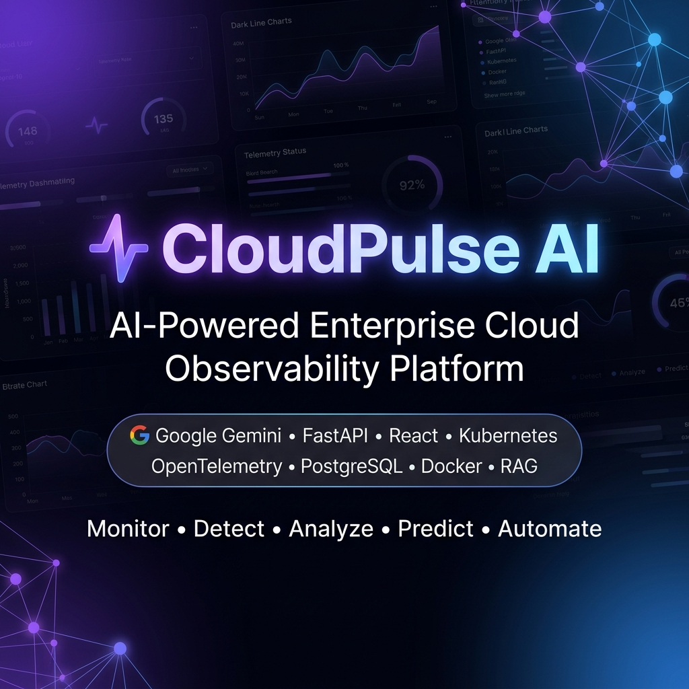

<p align="center">
  
</p>

# CloudPulse AI

> Premium enterprise infrastructure observability platform powered by AI.

## Tech Stack

| Layer       | Technology                          |
|-------------|-------------------------------------|
| Frontend    | React 18 + TypeScript + Vite        |
| Styling     | TailwindCSS + shadcn/ui             |
| Backend     | FastAPI (Python 3.11)               |
| Database    | PostgreSQL 15                       |
| AI          | Google Gemini API                   |
| Vector DB   | ChromaDB                            |
| Auth        | JWT (access + refresh tokens)       |
| Container   | Docker + Docker Compose             |

## Getting Started

### Prerequisites
- Node.js 20+
- Python 3.11+
- Docker & Docker Compose
- PostgreSQL 15 (or use Docker)

### Quick Start (Docker)

```bash
cp .env.example .env
# Fill in your secrets in .env
docker compose up --build
```

Frontend → http://localhost:5173  
Backend API → http://localhost:8000  
API Docs → http://localhost:8000/docs

### Local Development

#### Backend
```bash
cd backend
python -m venv .venv
source .venv/bin/activate      # Windows: .venv\Scripts\activate
pip install -r requirements.txt
alembic upgrade head
uvicorn app.main:app --reload --port 8000
```

#### Frontend
```bash
cd frontend
npm install
npm run dev
```

## Project Structure

```
CloudPulse-AI/
├── frontend/          # React + TypeScript + Vite
├── backend/           # FastAPI + Python
├── docker/            # Docker configs
├── docs/              # Documentation
├── .env.example       # Environment template
└── docker-compose.yml
```

## Environment Variables

Copy `.env.example` to `.env` and fill in values. See the file for descriptions.

## API Documentation

Interactive Swagger UI available at `/docs` when backend is running.

## License

MIT
