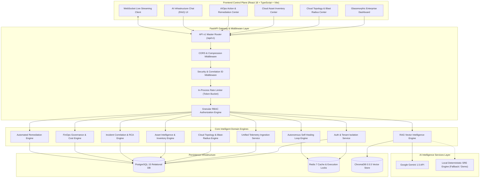

<p align="center">
  
</p>

<p align="center">
  <a href="https://python.org"></a>
  <a href="https://fastapi.tiangolo.com"></a>
  <a href="https://react.dev"></a>
  <a href="https://typescriptlang.org"></a>
  <a href="https://tailwindcss.com"></a>
  <a href="https://docker.com"></a>
  <a href="https://postgresql.org"></a>
  <a href="https://opentelemetry.io"></a>
  <a href="https://ai.google.dev"></a>
  <a href="LICENSE"></a>
</p>

<p align="center">
  <a href="https://github.com/NaniToka/CloudPulse-AI"></a>
  <a href="http://localhost:5173"></a>
  <a href="docs/index.md"></a>
  <a href="https://github.com/NaniToka/CloudPulse-AI/issues"></a>
</p>

---

## 🌟 Executive Summary (2-Minute Overview)

**CloudPulse AI** is an enterprise-grade **Autonomous Cloud Operations, Observability, FinOps Governance, and AIOps Platform**. Designed to solve the operational complexity of multi-cloud Kubernetes clusters, distributed microservices, and multi-region infrastructure, CloudPulse AI transforms reactive monitoring into **autonomous incident detection, predictive anomaly forecasting, root-cause analysis, topological blast-radius calculation, and self-healing auto-remediation**.

Inspired by enterprise benchmarks including **Google Cloud Operations (Stackdriver)**, **Datadog Watchdog**, **Dynatrace Davis AI**, and **Wiz CSPM**, CloudPulse AI integrates Google Gemini LLM reasoning with Retrieval-Augmented Generation (RAG), OpenTelemetry distributed tracing, sub-second WebSockets streaming, and multi-tenant RBAC into a unified glassmorphic control plane.

> 💡 **Demo vs. Live Mode Note**: Out-of-the-box, CloudPulse AI runs in **Deterministic Demo Mode** (`DEMO_MODE=true`). It seeds synthetic multi-cloud telemetry and uses a local deterministic SRE inference engine without requiring cloud credentials or external LLM API keys. Live mode enables real-time Google Gemini 1.5 reasoning and live cloud API streaming when configured.

---

## 🔴 Problem vs. 🟢 CloudPulse AI Solution

| 🔴 Traditional Observability Pain Points | 🟢 CloudPulse AI Autonomous Solution |
| :--- | :--- |
| **Alert Fatigue**: Thousands of un-correlated alerts flooding SRE PagerDuty on-call channels. | **Autonomous Event Correlation**: Gemini AI groups related telemetry across logs, traces, and metrics into unified root-cause insights. |
| **Manual Root Cause Diagnostics**: SREs waste hours jumping across disconnected log searchers and APM dashboards. | **Instant RAG Infrastructure Diagnostics**: Query cluster telemetry in natural language with vector-indexed evidence citations. |
| **Reactive Incident Response**: Engineers fix outages *after* customer impact occurs. | **Predictive Anomaly Detection**: Time-series forecasting predicts CPU, memory, disk, and SLO failures 30+ minutes ahead. |
| **Static Manual Runbooks**: Outdated wiki pages requiring manual shell execution. | **AI Runbook Generator & Auto Remediation**: Production remediation engine supporting Automated, Semi-Automated, and Manual workflows with safe rollback. |
| **Unbounded Cloud Costs**: Surprise AWS/GCP bills from idle instances and unattached storage. | **Enterprise FinOps Governance Center**: Continuous cloud spend tracking, budget enforcement, cost violation detection, and automated right-sizing. |
| **Blind Spots in Blast Radius**: Engineers cannot predict which services break during a resource outage. | **Cloud Topology & Blast-Radius Engine**: Multi-cloud dependency graph, topological blast radius calculation, Single Point of Failure (SPOF) detection, and failure simulation. |
| **Data Leakage in Multi-Tenant Environments**: Weak authorization rules leaking cross-department data. | **Enterprise Multi-Tenant Isolation**: Strict Organization, Team, and Project scoping with granular RBAC permissions and security audit logs. |

---

## 📐 System Architecture Diagram



---

## ⚡ Core Enterprise Capabilities

1. 🌐 **Enterprise Cloud Topology & Blast-Radius Center (`/topology`)**: Multi-cloud dependency graph, topological blast radius calculation (`CRITICAL`, `HIGH`, `MEDIUM`, `LOW`), SPOF detection, and failure propagation simulation with `"SIMULATION ONLY"` safety guards.
2. 📦 **Cloud Asset Intelligence & Resource Inventory (`/assets`)**: Unified asset tracking across AWS, GCP, Azure, and K8s, resource lifecycle classification (`ACTIVE`, `IDLE`, `ORPHANED`), waste detection, and security risk scores.
3. 👔 **Executive Operations Command Center (`/command-center`, `/executive`)**: Health scores, financial risk burn metrics, SLA summaries, and strategic executive AI snapshots.
4. 🔄 **Autonomous Self-Healing Ops (`/autonomous`)**: Closed-loop self-healing engine (`Observe ➔ Detect ➔ Analyze ➔ Plan ➔ Execute ➔ Verify`) under multi-tier safety controls (`AUTOMATED`, `SEMI_AUTOMATED`, `MANUAL`).
5. 🎯 **Service Reliability & SLO Intelligence 2.0 (`/reliability`, `/slo`)**: Real SLI/SLO measurement across availability, latency, error rate, throughput, and error budget exhaustion forecasting.
6. ⚡ **AIOps Action & Remediation Center (`/remediation`)**: Multi-stage approval workflows, dry-run validation, execution logging, and 1-click rollbacks.
7. 💰 **FinOps Governance & Cost Control (`/finops/governance`, `/cost`)**: Cost policy enforcement, budget violation alerts, cost anomaly detection, and right-sizing.
8. 🛡️ **Cloud Security Governance (`/governance`, `/security`)**: Security posture evaluation across 7 compliance frameworks (CIS, ISO 27001, SOC 2, NIST, PCI-DSS, HIPAA, GDPR).
9. 🤖 **Autonomous AIOps Agent (`/aiops`)**: Continuous 6-phase autonomous observability loop with explainable recommendation drawers.
10. 💬 **AI Infrastructure RAG Chat (`/chat`)**: Vector RAG querying ChromaDB collections (`metrics`, `logs`, `traces`, `incidents`, `alerts`, `cost`) with exact evidence citations.
11. 🔭 **Distributed Tracing Platform (`/tracing`)**: OpenTelemetry waterfall charts (`Load Balancer ➔ Gateway ➔ Auth ➔ Service ➔ Database`).
12. 📊 **Real-Time Observability Engine (`/monitoring`)**: Sub-second WebSockets metric streaming for CPU, Memory, Disk, Network, RPS, and P99 latency.

---

## 🛠️ Technology Stack Matrix

| Category | Technology | Usage in CloudPulse AI |
| :--- | :--- | :--- |
| **Backend Core** | FastAPI 0.111 / Python 3.12 | Async ASGI web framework with Pydantic v2 validation. |
| **Database** | PostgreSQL 15 | Relational storage with SQLAlchemy AsyncSession & 16 Alembic migrations. |
| **Caching & Locks** | Redis 7 | Session cache, execution locks, and JWT token revocation blocklist. |
| **Vector Store** | ChromaDB 0.5.5 | Embedded vector store for telemetry RAG infrastructure chat. |
| **AI Engine** | Google Gemini 1.5 / Local SRE | Generative AI reasoning with automatic fallback to local deterministic engine. |
| **Frontend** | React 18 / TypeScript 5.4 / Vite | Single Page Application with strict type safety. |
| **Styling** | Tailwind CSS 3.4 / Lucide | Glassmorphic dark-mode component design system. |
| **Live Telemetry** | WebSockets | Real-time sub-second metric streaming engine. |
| **Tracing** | OpenTelemetry | Distributed request tracing & APM span collection. |
| **Containerization**| Docker & Docker Compose | Multi-container development and production orchestration. |

---

## 🚀 Quickstart & One-Command Launch

### Option 1: Docker Compose (Recommended)

```bash
# 1. Clone repository
git clone https://github.com/NaniToka/CloudPulse-AI.git
cd CloudPulse-AI

# 2. Configure environment template
cp .env.example .env

# 3. Launch stack in detached mode
docker compose up --build -d
```

- 🌐 **Frontend Dashboard**: `http://localhost:5173`
- ⚡ **Backend API**: `http://localhost:8000`
- 📖 **Swagger OpenAPI Docs**: `http://localhost:8000/docs`
- 🔑 **Default Credentials**: `admin@cloudpulse.io` / `Password123!`

---

### Option 2: Production Docker Compose Stack

```bash
docker compose -f docker-compose.production.yml up -d --build
```
- 🌐 **Production Frontend Proxy**: `http://localhost:80`
- ⚡ **Production Backend API**: `http://localhost:8000`

---

## 📖 Technical Documentation Hub (`docs/`)

For in-depth architectural specifications, API schemas, deployment manifests, and operations guides, explore the modular documentation suite in `docs/`:

- 🗺️ [**Docs Index & Central Wiki**](docs/index.md)
- 📐 [**System Architecture & Data Flow**](docs/architecture.md)
- 🛠️ [**Tech Stack & Feature Overview**](docs/tech-stack-and-features.md)
- ⚙️ [**Local Setup, Environment Variables & Demo Mode**](docs/local-setup-and-demo-mode.md)
- 🐳 [**Docker Setup, Kubernetes Deployment & Troubleshooting**](docs/docker-and-deployment.md)
- 🗄️ [**Database Architecture & Alembic Migrations (`0001`–`0016`)**](docs/database-and-migrations.md)
- 🔒 [**Authentication, Multi-Tenancy & Granular RBAC**](docs/auth-and-rbac.md)
- 📡 [**API Reference, WebSockets & Health Probes**](docs/api-documentation.md)
- 🤖 [**AI Architecture, Gemini Integration & RAG Security**](docs/ai-architecture-and-security.md)
- 💰 [**FinOps Cost Governance & Asset Intelligence**](docs/finops-and-asset-intelligence.md)
- ☸️ [**Kubernetes Intelligence & Autonomous AIOps Loop**](docs/kubernetes-and-aiops.md)
- 🧪 [**Testing Suite, Code Quality & CI/CD Pipelines**](docs/testing-and-cicd.md)
- 🛠️ [**Operations & Troubleshooting Playbook**](docs/troubleshooting.md)

---

## 🛡️ Quality Engineering & CI/CD Status

- **Linter**: Passed [Ruff](https://astral.sh/ruff) (`py312` target).
- **Security Audit**: Passed [Bandit](https://github.com/PyCQA/bandit) static security analysis.
- **Async Pytest Suite**: 100+ async integration and unit tests passing against PostgreSQL & Redis.
- **Frontend Type Safety**: Strict TypeScript compiler checks (`tsc --noEmit`) with zero errors.
- **Frontend Linting**: ESLint checks with zero allowed warnings (`--max-warnings 0`).
- **Database Migrations**: Verified Alembic migrations up to head (`0016`).
- **CI/CD Pipelines**: Automated GitHub Actions (`ci.yml`, `docker-build.yml`, `security-scan.yml`).

---

## 📄 License

This project is licensed under the **MIT License** - see the [LICENSE](LICENSE) file for details.

---

<p align="center">
  <sub>Built with ❤️ by the CloudPulse AI Team • Powered by Google Gemini & OpenTelemetry</sub>
</p>
