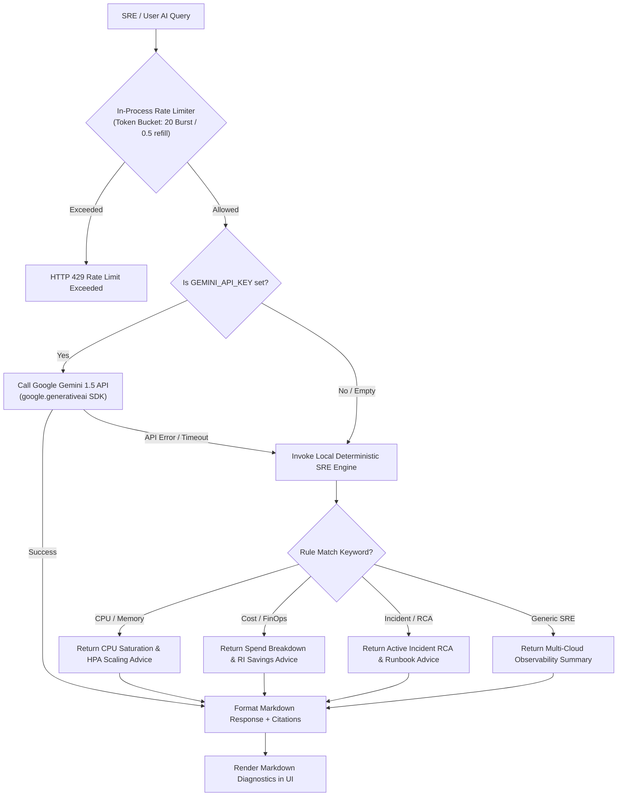
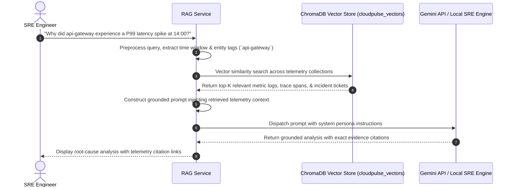

# CloudPulse AI — AI Architecture & AI Security

This document outlines the artificial intelligence architecture of **CloudPulse AI**, including Google Gemini LLM reasoning, the local deterministic SRE fallback engine, ChromaDB vector RAG retrieval pipelines, and AI security guardrails.

---

## 1. AI System Architecture & Fallback Flow

CloudPulse AI implements a dual-mode AI strategy: leveraging Google Gemini 1.5 when API keys are available, and seamlessly degrading to an in-process local deterministic SRE inference engine when running offline or without credentials.

---

## 2. Retrieval-Augmented Generation (RAG) Pipeline

The RAG pipeline (`backend/app/services/rag_service.py`) connects vector search memory with generative reasoning to ground AI outputs in actual telemetry evidence:

### ChromaDB Collections Schema (`chromadb==0.5.5`):
- `metrics`: Time-series metric anomaly snapshots.
- `logs`: Error log pattern clusters and stack traces.
- `traces`: OpenTelemetry high-latency span waterfalls.
- `incidents`: Past incident resolution reports and post-mortems.
- `alerts`: Alert firing history and threshold breaches.
- `cost`: Cloud resource bill items and idle waste telemetry.

---

## 3. In-Process Token Bucket Rate Limiting

To prevent API abuse and control Google Gemini quota consumption, `backend/app/services/ai_service.py` enforces a thread-safe token bucket rate limiter per user UUID:

- **Burst Capacity**: 20 requests
- **Refill Rate**: 0.5 tokens/sec (1 request every 2 seconds sustained)
- **Scope**: Applied automatically to `/api/v1/ai/chat` and `/api/v1/ai/stream`.

---

## 4. AI Security & Guardrails Architecture

CloudPulse AI enforces multi-layered AI security controls to guarantee safety, zero telemetry leakage, and defense against prompt injection:

1. **System Persona Prompt Locking**: System prompts strictly constrain the AI persona to Site Reliability Engineering, cloud architecture, and DevOps contexts. Non-IT requests are automatically rejected.
2. **Zero Hardcoded Credentials**: API keys are read exclusively from environment variables via Pydantic Settings. Keys are never logged in `structlog` traces.
3. **Data Anonymization & PII Stripping**: Log snippets and traces are scrubbed for sensitive headers (`Authorization`, `Cookie`, `Set-Cookie`) and credentials before being processed by LLMs or vector indexing.
4. **Deterministic Fallback Safety**: The local SRE fallback engine generates static, validated markdown responses with zero external network connectivity requirements, guaranteeing total isolation for high-security environments.
5. **Static Code Analysis**: All AI service code passes continuous security scanning via **Bandit** (`bandit -r backend/app`) and **Safety** dependency vulnerability checks.
