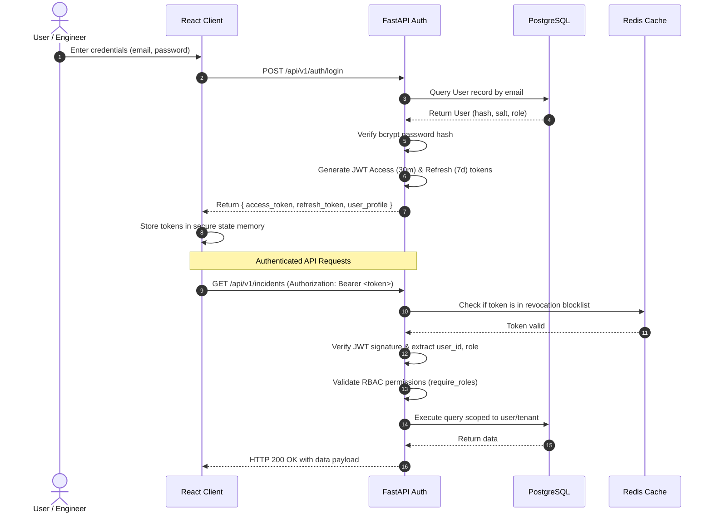
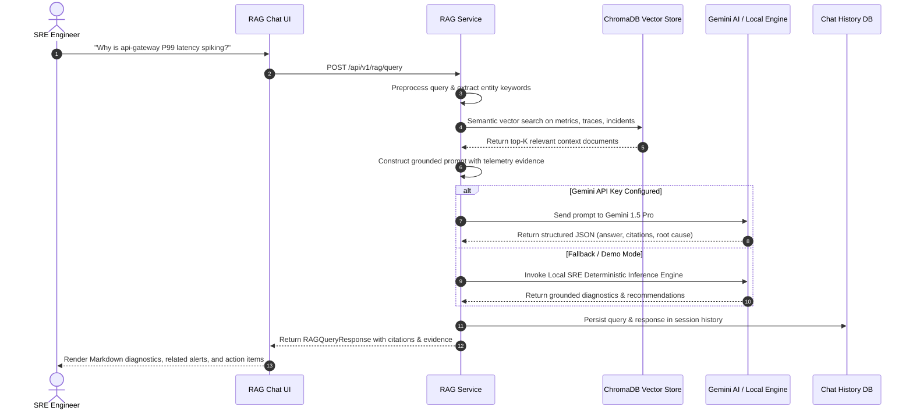
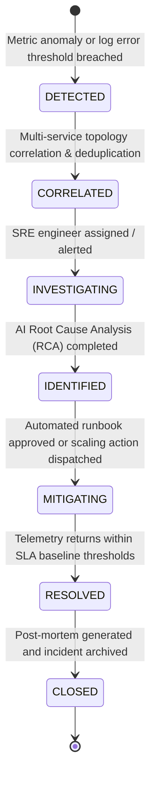
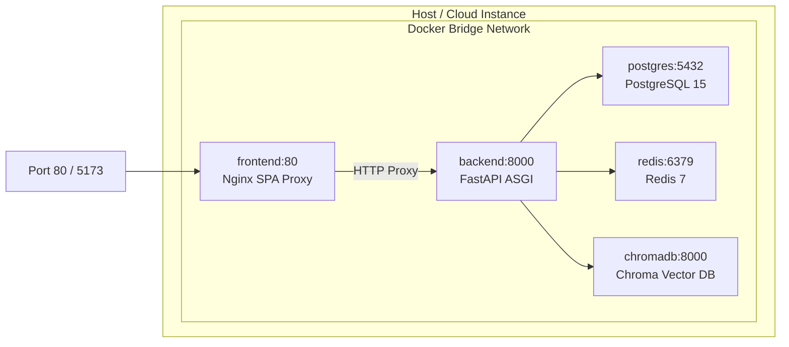

# CloudPulse-AI — Enterprise System Architecture Documentation

## 1. System Architecture Diagram

```mermaid
graph TB
    subgraph Client Layer
        WebBrowser["Web Browser (React SPA)"]
        CLI["CLI / API Consumers"]
    end

    subgraph Ingress & Gateway Layer
        Nginx["Nginx Reverse Proxy (Port 80/443)"]
        SPA_Static["Static Assets (/usr/share/nginx/html)"]
    end

    subgraph Backend Application Layer (FastAPI)
        AuthMW["Security & Correlation Middleware"]
        Router["API Router (/api/v1)"]
        
        subgraph Core Services
            AuthService["Auth & RBAC Service"]
            TelemetryService["Telemetry & Metric Ingestion"]
            IncidentService["Incident & RCA Engine"]
            CostService["FinOps Cost Optimizer"]
            LogService["AI Log Parser & Analyzer"]
            RAGService["RAG Intelligence Pipeline"]
            AIOpsService["Autonomous AIOps Agent"]
            RunbookService["Runbook Automation Service"]
        end
    end

    subgraph Data & Storage Layer
        PostgreSQL[("PostgreSQL 15 (Relational DB)")]
        Redis[("Redis 7 (Cache & Sessions)")]
        ChromaDB[("ChromaDB (Vector Store)")]
    end

    subgraph AI Intelligence Layer
        GeminiAPI["Google Gemini 1.5 API"]
        LocalEngine["Local Deterministic SRE Engine (Fallback)"]
    end

    WebBrowser --> Nginx
    CLI --> Nginx
    Nginx --> SPA_Static
    Nginx -->|Proxy /api/*| AuthMW
    AuthMW --> Router

    Router --> AuthService
    Router --> TelemetryService
    Router --> IncidentService
    Router --> CostService
    Router --> LogService
    Router --> RAGService
    Router --> AIOpsService
    Router --> RunbookService

    AuthService --> PostgreSQL
    AuthService --> Redis
    TelemetryService --> PostgreSQL
    IncidentService --> PostgreSQL
    CostService --> PostgreSQL
    LogService --> PostgreSQL
    RAGService --> ChromaDB
    RAGService --> GeminiAPI
    RAGService -.-> LocalEngine
    LogService --> GeminiAPI
    LogService -.-> LocalEngine
    AIOpsService --> PostgreSQL
    RunbookService --> PostgreSQL
```

---

## 2. Authentication & RBAC Flow



---

## 3. RAG Intelligence Pipeline Flow



---

## 4. Incident Lifecycle & Correlation Engine



---

## 5. Deployment Topology


