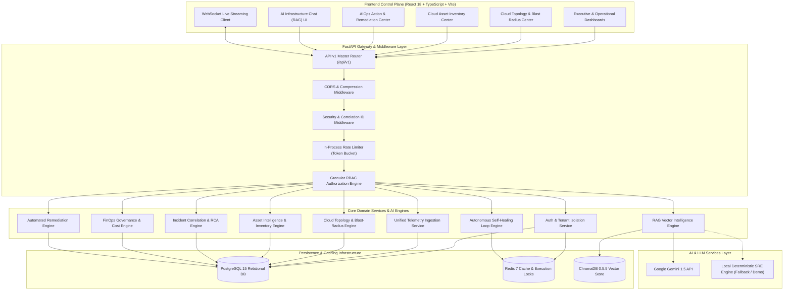
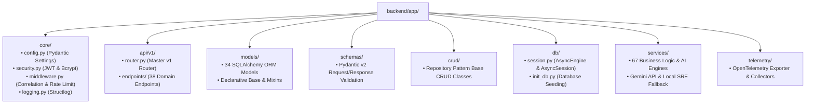
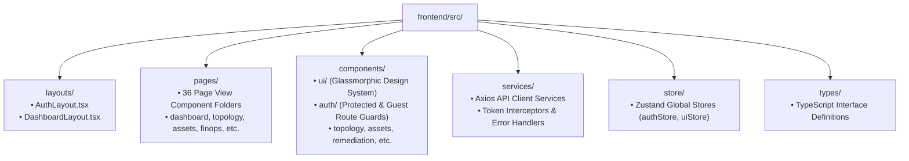
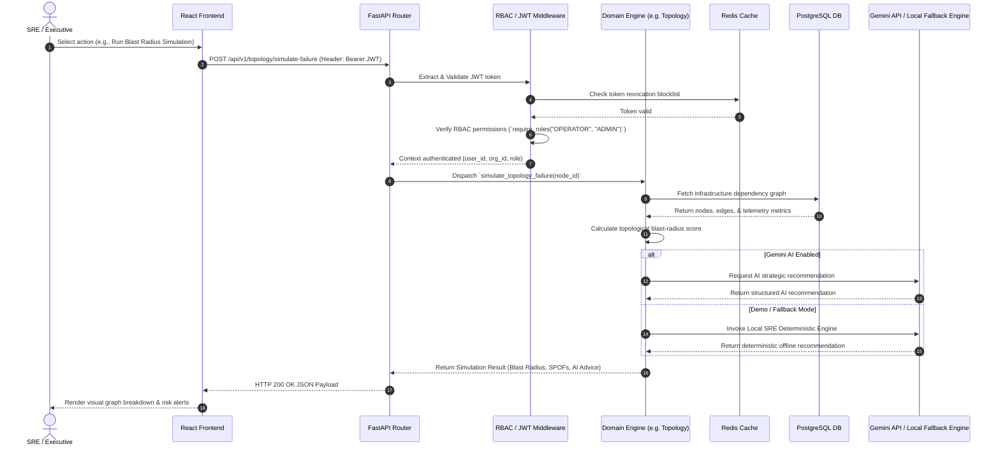

# CloudPulse AI — Enterprise System Architecture

This document provides a detailed breakdown of the **CloudPulse AI** system architecture, component relationships, data flow patterns, backend module hierarchy, frontend client structure, and data persistence models.

---

## 1. High-Level System Architecture Diagram

The system follows an event-driven, microservices-ready layered architecture. The React SPA communicates with the FastAPI API Gateway via REST and WebSockets, while the backend orchestrates data across PostgreSQL, Redis, ChromaDB, and Google Gemini API (or the local deterministic fallback engine).

---

## 2. Backend Component Structure

The backend application is built on FastAPI and follows a modular repository pattern with strict separation between routes, services, data models, and database access.

### Key Backend Components:
1. **API Router Layer (`app/api/v1/endpoints/`)**: Contains 38 router modules managing REST routes (`auth`, `incidents`, `topology`, `finops_governance`, `remediation`, etc.).
2. **Business Logic Layer (`app/services/`)**: Contains 67 service modules powering topology calculations, blast radius predictions, AI log parsing, RAG querying, FinOps cost policies, and autonomous self-healing loops.
3. **ORM Models Layer (`app/models/`)**: Defines SQLAlchemy 2.0 async models with table constraints, foreign keys, indexes, and JSON fields.
4. **Database Session Layer (`app/db/session.py`)**: Uses `asyncpg` driver with SQLAlchemy `AsyncSession` for high-concurrency non-blocking database queries.

---

## 3. Frontend Component Structure

The frontend is a single-page application (SPA) built with React 18, TypeScript, Vite, and TailwindCSS. It leverages TanStack React Query for async server-state caching and Zustand for lightweight global UI state.

### Key Frontend Views (`src/pages/`):
- **Command Center & Executive Operations**: `/executive`, `/command-center`, `/dashboard`
- **Cloud Infrastructure & Topology**: `/topology`, `/assets`, `/cloud`, `/cloud/accounts`, `/cloud/resources`, `/infrastructure`, `/servers`
- **AIOps & Self-Healing Ops**: `/autonomous`, `/aiops`, `/remediation`, `/runbooks`, `/workflows`
- **FinOps & Cost Governance**: `/cost`, `/finops/governance`
- **Observability & Reliability**: `/monitoring`, `/tracing`, `/logs`, `/telemetry`, `/incidents`, `/sre`, `/slo`, `/reliability`, `/dependencies`, `/predictions`
- **Kubernetes & Digital Twin**: `/k8s`, `/k8s/pods`, `/k8s/deployments`, `/twin`, `/twin/simulation/:id`
- **AI Infrastructure Chat & Security**: `/chat`, `/ai`, `/security`, `/governance`
- **Organization & Administration**: `/organization`, `/settings`, `/alerts`, `/notifications`, `/platform-health`

---

## 4. End-to-End Request & Data Flow

When an SRE or executive interacts with CloudPulse AI, requests follow a strictly authenticated and validated pipeline:

---

## 5. Telemetry & Data Storage Strategy

| Data Type | Primary Store | Backup/Cache Store | Purpose |
| :--- | :--- | :--- | :--- |
| **Relational Data** | PostgreSQL 15 | Disk Snapshots | Users, Orgs, Teams, Projects, Incidents, SLOs, Policies, Runbooks |
| **Session & Locks** | Redis 7 | In-Memory Fallback | JWT Revocation list, Execution Locks for remediation, Metric Cache |
| **RAG Embeddings** | ChromaDB 0.5.5 | Local Disk (`chroma_db_data`) | Vector embeddings for logs, metrics, traces, and incident post-mortems |
| **Time-Series Metrics** | Postgres / Redis | Memory Buffer | Live WebSockets streaming metrics (CPU, Memory, Disk, RPS, P99) |
