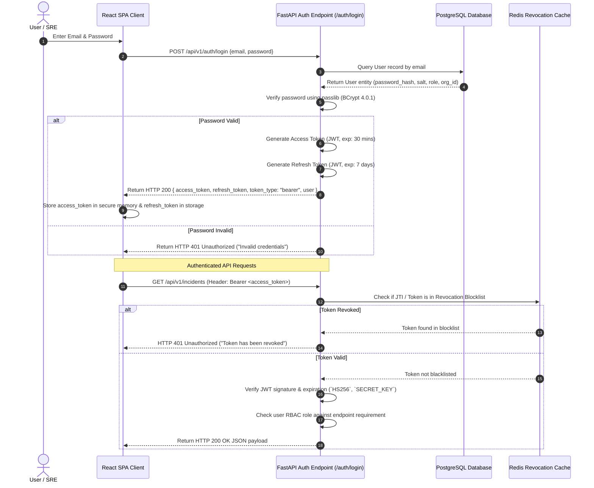

# CloudPulse AI — Authentication & RBAC Architecture

This document specifies the multi-tenant security model, JWT authentication token lifecycle, password hashing standards, Redis token revocation blocklist, and granular Role-Based Access Control (RBAC) authorization matrix.

---

## 1. Authentication Flow Sequence Diagram

The authentication subsystem is implemented in `backend/app/core/security.py` and `backend/app/api/v1/endpoints/auth.py`.



---

## 2. Multi-Tenant Organization Isolation

CloudPulse AI uses a strict 3-tier organizational hierarchy to ensure zero cross-tenant data leakage:

```
Organization (e.g. Acme Corp)
├── Team (e.g. Platform Engineering)
│   └── Members (Users with Team-level roles)
└── Projects (e.g. Payment Gateway Workspace)
    └── Monitored Resources (Servers, Clusters, Incidents, Budgets)
```

- **Organization Isolation**: Every primary domain model (`Server`, `Incident`, `SLO`, `FinOpsBudget`, `Policy`) includes an `organization_id` foreign key.
- **Tenant Scope Enforcement**: FastAPI dependencies (`app/api/v1/endpoints/dependencies.py`) extract the `organization_id` from the caller's JWT token and inject `WHERE organization_id = :org_id` clauses into all database queries automatically.

---

## 3. Cryptographic Standards & Token Lifecycle

| Mechanism | Technology / Parameter | Specifications |
| :--- | :--- | :--- |
| **Password Hashing** | BCrypt (`passlib[bcrypt]`) | Work factor parameter set to secure default (`bcrypt==4.0.1`). |
| **JWT Signature** | HMAC SHA-256 (`HS256`) | Signed using `SECRET_KEY` or `JWT_SECRET_KEY` (32-byte minimum). |
| **Access Tokens** | Short-Lived JWT | Lifetime: **30 minutes** (configurable via `JWT_ACCESS_TOKEN_EXPIRE_MINUTES`). |
| **Refresh Tokens** | Long-Lived JWT | Lifetime: **7 days** (configurable via `JWT_REFRESH_TOKEN_EXPIRE_DAYS`). |
| **Token Revocation** | Redis Blocklist (`REDIS_URL`) | Expired or logged-out token JTIs are cached until token expiry. |

---

## 4. Role-Based Access Control (RBAC) Permission Matrix

The application defines three system-level RBAC roles: `ADMIN`, `OPERATOR`, and `VIEWER`. Endpoints enforce role checks using the `require_roles(...)` decorator dependency.

| Feature / Resource Area | Endpoint Route Group | `ADMIN` | `OPERATOR` | `VIEWER` |
| :--- | :--- | :---: | :---: | :---: |
| **Read Dashboards & Metrics** | `/metrics`, `/cloud`, `/k8s`, `/assets` | ✅ | ✅ | ✅ |
| **Read Incidents & Logs** | `/incidents`, `/logs`, `/traces` | ✅ | ✅ | ✅ |
| **Read SLOs & Reliability Analytics**| `/slo`, `/reliability`, `/sre` | ✅ | ✅ | ✅ |
| **Execute AI Infrastructure Chat** | `/chat`, `/ai` | ✅ | ✅ | ✅ |
| **Simulate Failure & Blast Radius** | `/topology/simulate-failure`, `/twin` | ✅ | ✅ | ❌ |
| **Acknowledge / Resolve Incidents** | `/incidents/{id}/acknowledge` | ✅ | ✅ | ❌ |
| **Trigger Automated Runbook Actions** | `/runbooks/{id}/execute`, `/remediation` | ✅ | ✅ | ❌ |
| **Approve Self-Healing Remediation**| `/autonomous/approve-action` | ✅ | ✅ | ❌ |
| **Manage FinOps Policies & Budgets** | `/finops/policies`, `/cost` | ✅ | ✅ | ❌ |
| **Manage Users & Organization** | `/users`, `/organizations`, `/members` | ✅ | ❌ | ❌ |
| **Modify System Security Credentials**| `/auth/reset-password`, `/settings` | ✅ | ❌ | ❌ |

---

## 5. Security Audit Logging

All administrative actions, authentication attempts, policy edits, and remediation executions trigger structured audit logs (`backend/app/services/audit_service.py`):

```json
{
  "timestamp": "2026-08-19T19:14:15Z",
  "event": "remediation_action_executed",
  "actor_id": "usr_94a821f",
  "actor_email": "admin@cloudpulse.io",
  "organization_id": "org_e27b14a",
  "role": "ADMIN",
  "action": "SCALE_DEPLOYMENT",
  "target_resource": "api-gateway",
  "status": "SUCCESS",
  "correlation_id": "req-8b2e104"
}
```
