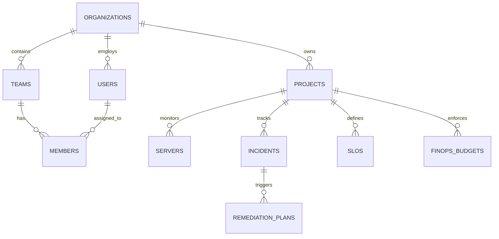

# CloudPulse AI — Database Architecture & Alembic Migrations

This document details the relational database architecture, SQLAlchemy 2.0 asynchronous ORM models, multi-tenant isolation schemas, and the complete 16-step Alembic database migration history (`0001` through `0016`).

---

## 1. Database Architecture & Technology Stack

CloudPulse AI uses **PostgreSQL 15** as its primary relational store. 

- **Async Driver**: `asyncpg` combined with SQLAlchemy `AsyncSession` for non-blocking I/O.
- **Sync Fallback Driver**: `psycopg2-binary` for sync CLI utilities and offline Alembic migration scripts.
- **Connection String DSN**: `postgresql+asyncpg://<user>:<pass>@<host>:<port>/<dbname>`
- **Database Engine Setup**: Configured in `backend/app/db/session.py` with `pool_pre_ping=True`.



---

## 2. ORM Models Inventory (`backend/app/models/`)

The application defines 34 SQLAlchemy model files mapping core enterprise domain entities:

| Model File | Key Entities / Tables | Domain Description |
| :--- | :--- | :--- |
| **`user.py`** | `User` | User profiles, email, password hash, role (`ADMIN`, `OPERATOR`, `VIEWER`), status. |
| **`organization.py`** | `Organization` | Multi-tenant organization boundaries, tier (`FREE`, `PRO`, `ENTERPRISE`), settings. |
| **`tenant.py`** | `Tenant`, `Team`, `Member` | Departmental team hierarchy, tenant isolation keys, and membership roles. |
| **`project.py`** | `Project` | Scoped infrastructure workspace projects. |
| **`infrastructure.py`** | `Server`, `Cluster`, `Node` | Server inventory, IP addresses, specs, CPU/Memory load metrics. |
| **`incident.py`** | `Incident`, `IncidentRCA`, `Timeline` | Active incidents, AI root cause analysis records, and resolution timeline logs. |
| **`telemetry.py`** | `TelemetryMetric`, `LogEntry` | Normalized telemetry metrics and indexed server log entries. |
| **`trace.py`** | `TraceSpan` | OpenTelemetry distributed trace spans, parent-child spans, duration, tags. |
| **`slo.py`** | `SLO`, `SLI`, `ErrorBudget` | Service Level Objectives, targets, SLI indicators, and budget burn tracking. |
| **`runbook.py`** | `Runbook`, `RunbookExecution` | Automated SRE runbooks, execution logs, dry-run validations, and rollbacks. |
| **`autonomous.py`** | `AutonomousPolicy`, `SelfHealingLog` | Closed-loop autonomy safety policies, maintenance windows, and locks. |
| **`finops_governance.py`**| `FinOpsBudget`, `CostAnomaly`, `Policy` | Multi-cloud budget guardrails, cost anomaly records, and right-sizing rules. |
| **`governance.py`** | `GovernanceFramework`, `AuditRecord` | CSPM compliance benchmarks (CIS, SOC2, ISO27001) and security audit trail. |
| **`command_center.py`**| `CommandCenterSnapshot` | Executive operational snapshots, financial burn metrics, and strategic insights. |

---

## 3. Complete Alembic Migrations Breakdown (`0001` – `0016`)

Database migrations are managed with **Alembic** (`backend/alembic/versions/`). Every migration script is idempotent and version-controlled:

| Revision ID | Migration Name | Description & Key Schema Changes |
| :--- | :--- | :--- |
| **`0001`** | `0001_initial_schema.py` | Baseline tables: `users`, `organizations`, `teams`, `projects`, `servers`, `metrics`, `incidents`, `alerts`. |
| **`0002`** | `0002_add_log_analyses.py` | Adds `log_analyses` table storing AI log parsing results and error pattern clusters. |
| **`0003`** | `0003_add_cost_optimizer_tables.py` | Adds `cloud_costs`, `cost_recommendations`, and `cloud_resources` for FinOps tracking. |
| **`0004`** | `0004_add_service_nodes_and_dependencies.py` | Adds `service_nodes` and `service_dependencies` tables for topology graph mapping. |
| **`0005`** | `0005_enhance_predictions_and_anomalies.py` | Adds `predictive_anomalies` and `capacity_forecasts` for time-series ML prediction. |
| **`0006`** | `0006_add_incident_verification_fields.py` | Extends `incidents` with verification status, automated rollback flags, and RCA score. |
| **`0007`** | `0007_add_ai_security_center.py` | Adds `security_scans`, `vulnerability_findings`, and `compliance_postures`. |
| **`0008`** | `0008_add_finops_budgets.py` | Adds `finops_budgets` and budget threshold notification alert triggers. |
| **`0009`** | `0009_add_sre_reliability_tables.py` | Adds `sre_error_budgets`, `toil_metrics`, and incident post-mortem records. |
| **`0010`** | `0010_add_governance_compliance_tables.py` | Adds `governance_frameworks` and cross-cloud security compliance policy drift logs. |
| **`0011`** | `0011_add_finops_governance_tables.py` | Adds `finops_governance_policies` and automated cost violation enforcement logs. |
| **`0012`** | `0012_add_autonomous_operations_tables.py` | Adds `autonomous_policies`, `self_healing_actions`, and execution locks. |
| **`0013`** | `0013_add_slo_intelligence_center_tables.py` | Adds `slo_definitions`, `sli_measurements`, and error budget exhaustion predictions. |
| **`0014`** | `0014_add_command_center_tables.py` | Adds `command_center_snapshots` for executive cloud health and risk history. |
| **`0015`** | `0015_add_service_reliability_tables.py` | Adds `service_reliability_analytics` and SLA compliance measurement metrics. |
| **`0016`** | `0016_add_remediation_policy_table.py` | Adds `remediation_policies` and action plan approval workflow tracking. |

---

## 4. Alembic Migration Commands

```bash
# 1. Inspect current migration revision status
alembic current

# 2. Upgrade database schema to head (latest revision 0016)
alembic upgrade head

# 3. Rollback database schema by 1 step
alembic downgrade -1

# 4. Generate new migration script after modifying SQLAlchemy models
alembic revision --autogenerate -m "describe_your_changes"
```
