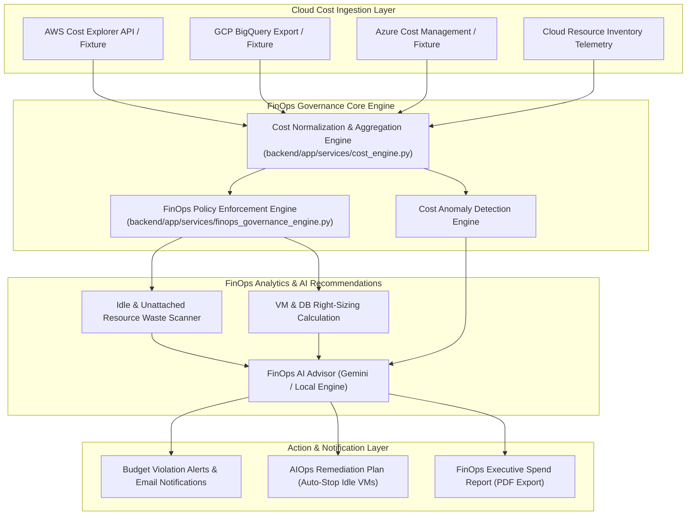
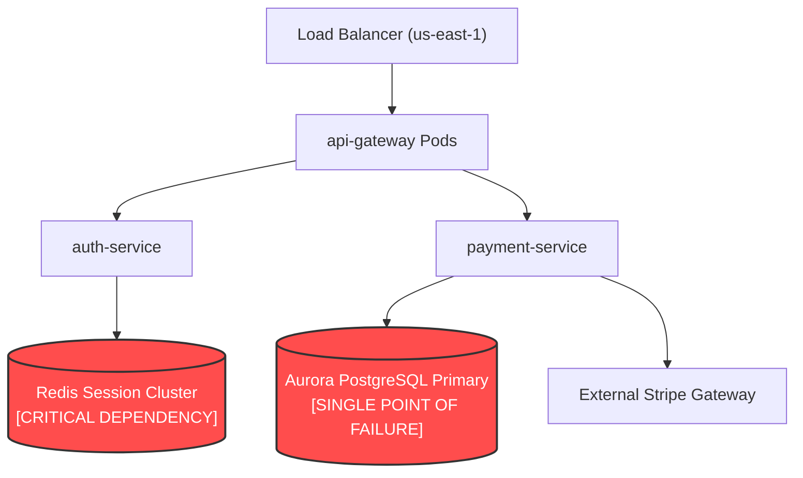

# CloudPulse AI — FinOps Architecture & Asset Intelligence

This document specifies the FinOps cost governance architecture, continuous cloud spend tracking, FinOps data flow pipeline, asset inventory lifecycle engine, and topological blast-radius calculation.

---

## 1. FinOps Data Flow Architecture

The FinOps engine continuously ingests cloud cost items, evaluates budget policies, detects cost anomalies, and generates right-sizing remediation recommendations.

---

## 2. Enterprise Cloud Asset Intelligence & Inventory

The Asset Intelligence Engine (`backend/app/services/asset_intelligence_engine.py`) aggregates multi-cloud resources across AWS, GCP, Azure, and Kubernetes into a unified inventory.

### Key Capabilities:
- **Resource Lifecycle Classification**: Categorizes assets as `ACTIVE`, `IDLE`, `DEGRADED`, `ORPHANED`, or `DECOMMISSIONED`.
- **Waste Identification**: Automatically flags unattached EBS volumes, unassociated Elastic IPs, idle load balancers, and underutilized EC2 instances (< 2% CPU average).
- **Security & Governance Risk Scoring**: Assigns a normalized risk score (0-100) based on patch status, open security group ports, and compliance policy violations.

---

## 3. Cloud Topology & Blast-Radius Engine

The Cloud Topology Engine (`backend/app/services/cloud_topology_engine.py`) constructs a directed graph representing infrastructure component dependencies across regions, clusters, databases, and microservices.

### Deterministic Blast-Radius Calculation:
When an engineer triggers a failure simulation (`POST /api/v1/topology/simulate-failure`), the engine calculates the topological blast radius:
1. **Graph Traversal**: Identifies all direct and transitive downstream dependencies.
2. **Blast Impact Rating**: Classifies severity as `CRITICAL`, `HIGH`, `MEDIUM`, or `LOW` based on node criticality scores.
3. **Single Point of Failure (SPOF) Detection**: Flags nodes that have no redundant failover replicas.
4. **Safety Guards**: All failure simulations carry mandatory `"SIMULATION ONLY"` execution flags, ensuring live production infrastructure is never altered during testing.
