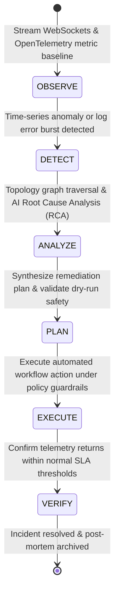

# CloudPulse AI — Kubernetes Intelligence & Autonomous AIOps

This document specifies the Kubernetes container observability platform, AIOps incident correlation engine, predictive time-series anomaly forecasting, and the 6-phase closed-loop autonomous self-healing operational engine.

---

## 1. Kubernetes & Container Intelligence

The Kubernetes module (`backend/app/services/kubernetes_service.py`) delivers continuous container telemetry, workload state inspection, and node cluster health tracking.

### Core Kubernetes Capabilities:
- **Cluster & Namespace Explorer**: Multi-cluster monitoring across production, staging, and dev namespaces.
- **Workload Status Inspection**: Real-time telemetry for Deployments, StatefulSets, DaemonSets, Pods, and Services.
- **Pod Resource Metrics**: Container-level CPU usage, memory RSS, disk I/O, restart counts, and OOMKilled events.
- **Automated Remediation Actions**: Scale deployment replicas (`kubectl scale`), restart crashing pods (`kubectl rollout restart`), and inspect pod logs.

---

## 2. Autonomous AIOps & Observability Engine

The AIOps Engine (`backend/app/services/aiops_service.py`) automates incident discovery and root-cause analysis by correlating telemetry across disconnected metrics, logs, and distributed trace spans.

### The 6-Phase Autonomous Self-Healing Operational Loop:
1. **Observe**: Ingest real-time sub-second WebSockets metrics, OpenTelemetry traces, and server logs.
2. **Detect**: Predictive algorithms flag early warning anomalies 30+ minutes before SLA degradation occurs.
3. **Analyze**: AI engine isolates exact root cause using graph topological correlation and log clustering.
4. **Plan**: Synthesizes a structured remediation action plan with automated rollback safety hooks.
5. **Execute**: Dispatches remediation script under multi-tier policy guardrails (`AUTOMATED`, `SEMI_AUTOMATED`, `MANUAL`).
6. **Verify**: Monitors post-remediation metrics to verify SLA recovery and release execution locks.

---

## 3. Autonomy Safety Control Tiers

CloudPulse AI provides multi-tier policy safety controls (`backend/app/services/autonomous/`) to enforce human-in-the-loop governance over automated remediation actions:

| Autonomy Tier | Description | Approval Requirement | Execution Mode |
| :--- | :--- | :--- | :--- |
| **`AUTOMATED`** | Fully autonomous self-healing. Non-destructive actions (e.g. cache flush, pod scaling). | Zero manual approval required. Logged to audit trail. | Immediate background dispatch. |
| **`SEMI_AUTOMATED`** | Semi-autonomous execution. Requires single-click SRE confirmation. | 1-Click approval in SRE Action Center (`/remediation`). | Dispatched upon approval. |
| **`MANUAL`** | Strict manual control. System synthesizes runbook plan for human execution. | Manual shell / kubectl execution by SRE engineer. | Manual execution only. |

### Safety Guardrails & Maintenance Windows:
- **Execution Locks**: Redis-backed locks (`lock:remediation:<resource_id>`) prevent concurrent conflicting actions on the same resource.
- **Automated Rollbacks**: If post-execution telemetry degrades beyond safety thresholds within 5 minutes, the engine automatically executes a 1-click rollback script.
- **Maintenance Windows**: Autonomy rules are suspended during scheduled maintenance windows.
