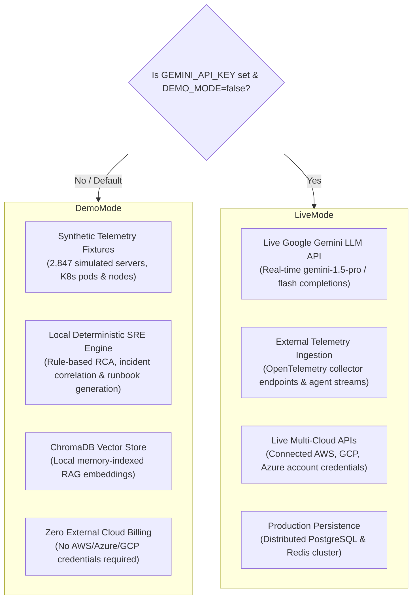

# CloudPulse AI — Local Setup, Environment Variables & Demo Mode Guide

This document provides step-by-step instructions for running **CloudPulse AI** locally, a complete reference table of all supported environment variables, and an explicit breakdown distinguishing **Local Deterministic Demo Mode** from **Live Cloud Integration Mode**.

---

## 1. Prerequisites

Ensure your development machine meets the following baseline requirements:

| Tool | Minimum Version | Recommended | Notes |
| :--- | :--- | :--- | :--- |
| **Python** | 3.11+ | 3.12 | Required for local backend runtime |
| **Node.js** | 20.x LTS | 20.11+ | Required for local frontend development |
| **npm** | 10.x | 10.5+ | Node package manager |
| **Docker & Compose** | Docker 24.0+ | Docker Desktop 4.25+ | Optional if running services natively |
| **PostgreSQL** | 15.0+ | 15.4 | Required if running backend natively without Docker |
| **Redis** | 7.0+ | 7.2 | Required if running backend natively without Docker |

---

## 2. Local Setup Guide (Without Docker)

### Step 1: Clone the Repository
```bash
git clone https://github.com/NaniToka/CloudPulse-AI.git
cd CloudPulse-AI
```

### Step 2: Backend Setup
1. Navigate to the `backend` directory:
   ```bash
   cd backend
   ```
2. Create and activate a Python virtual environment:
   ```bash
   python3 -m venv venv
   source venv/bin/activate  # On Windows: venv\Scripts\activate
   ```
3. Install dependencies:
   ```bash
   pip install --upgrade pip
   pip install -r requirements.txt
   ```
4. Configure environment variables:
   ```bash
   cp .env.example .env
   # Edit .env with your local PostgreSQL DSN and settings
   ```
5. Apply database migrations:
   ```bash
   alembic upgrade head
   ```
6. Start the FastAPI ASGI development server:
   ```bash
   uvicorn app.main:app --host 0.0.0.0 --port 8000 --reload
   ```
   *The backend server will start at `http://localhost:8000` with Swagger docs at `http://localhost:8000/docs`.*

### Step 3: Frontend Setup
1. Open a new terminal and navigate to the `frontend` directory:
   ```bash
   cd frontend
   ```
2. Install Node dependencies:
   ```bash
   npm ci
   ```
3. Configure environment variables (optional):
   ```bash
   cp .env.example .env.local
   ```
4. Start the Vite development server:
   ```bash
   npm run dev
   ```
   *The React SPA will start at `http://localhost:5173`.*

---

## 3. Environment Variables Reference

All application settings are loaded dynamically via `pydantic-settings` (`backend/app/core/config.py`).

| Variable Name | Type | Default Value | Description |
| :--- | :--- | :--- | :--- |
| **`APP_ENV`** | String | `development` | Runtime environment: `development`, `demo`, or `production`. |
| **`APP_NAME`** | String | `CloudPulse AI` | Display name of the platform application. |
| **`APP_VERSION`** | String | `1.0.0` | Semantic version string. |
| **`DEMO_MODE`** | Boolean | `true` | When true, seeds deterministic synthetic telemetry fixtures and enables offline AI. |
| **`BACKEND_HOST`** | String | `0.0.0.0` | Host binding interface for FastAPI uvicorn server. |
| **`BACKEND_PORT`** | Integer | `8000` | Port for the backend ASGI web application. |
| **`BACKEND_RELOAD`** | Boolean | `true` | Enables auto-reload on python file modifications in dev mode. |
| **`DATABASE_URL`** | String | `postgresql+asyncpg://...` | Async PostgreSQL connection string DSN. |
| **`SECRET_KEY`** | String | `None` | Cryptographic secret for signing JWT access and refresh tokens. |
| **`JWT_SECRET_KEY`** | String | `insecure_default...` | Fallback secret key if `SECRET_KEY` is not provided. |
| **`JWT_ALGORITHM`** | String | `HS256` | Cryptographic algorithm used for signing JWTs. |
| **`JWT_ACCESS_TOKEN_EXPIRE_MINUTES`** | Integer | `30` | Access token lifespan in minutes. |
| **`JWT_REFRESH_TOKEN_EXPIRE_DAYS`** | Integer | `7` | Refresh token lifespan in days. |
| **`CORS_ORIGINS`** | List/Str | `http://localhost:5173` | Allowed CORS origins (accepts JSON array, comma-separated, or single string). |
| **`REDIS_URL`** | String | `redis://localhost:6379/0` | Redis connection URL for caching, sessions, and locks. |
| **`CHROMA_HOST`** | String | `localhost` | Hostname of the ChromaDB vector database service. |
| **`CHROMA_PORT`** | Integer | `8001` | Service port for ChromaDB HTTP client interface. |
| **`CHROMA_COLLECTION_NAME`** | String | `cloudpulse_vectors` | Collection name for vector embeddings storage. |
| **`GEMINI_API_KEY`** | String | `""` | Optional Google Gemini API Key. If empty, system uses local SRE engine. |
| **`GEMINI_MODEL`** | String | `gemini-1.5-pro` | Gemini model name used for generative AI features. |
| **`GEMINI_MAX_OUTPUT_TOKENS`** | Integer | `8192` | Maximum token limit for Gemini LLM responses. |
| **`GEMINI_TEMPERATURE`** | Float | `0.7` | Temperature parameter governing AI output randomness. |
| **`LOG_LEVEL`** | String | `INFO` | Logging verbosity level (`DEBUG`, `INFO`, `WARNING`, `ERROR`). |
| **`LOG_FORMAT`** | String | `text` | Logging output format (`text` or `json`). |

---

## 4. Demo Mode vs. Live Cloud Integration Mode

CloudPulse AI explicitly distinguishes between **Local Deterministic Demo Mode** and **Live Cloud Integration Mode**:



### Key Differences Summary:

| Feature Dimension | Local Deterministic Demo Mode (`DEMO_MODE=true`) | Live Cloud Integration Mode (`DEMO_MODE=false`) |
| :--- | :--- | :--- |
| **Cloud Provider Credentials** | **Not Required**. Synthetic datasets simulate multi-cloud workloads. | **Required**. Cloud accounts are connected via API keys / IAM roles. |
| **AI LLM Reasoning** | **In-Process SRE Rule Engine**. Generates grounded deterministic insights. | **Google Gemini 1.5 API**. Generates custom unstructured LLM reasoning. |
| **Infrastructure Telemetry** | Seeded deterministic time-series fixtures across simulated servers. | Real-time OpenTelemetry ingestion pipeline (`/api/v1/telemetry`). |
| **Vector Search (RAG)** | Local ChromaDB instance with pre-indexed synthetic context docs. | Production ChromaDB instance dynamically populated with live telemetry. |
| **Cost Governance** | Simulated FinOps bill items, idle node waste, and right-sizing logic. | Connected cloud billing API data (AWS Cost Explorer, GCP Billing). |
