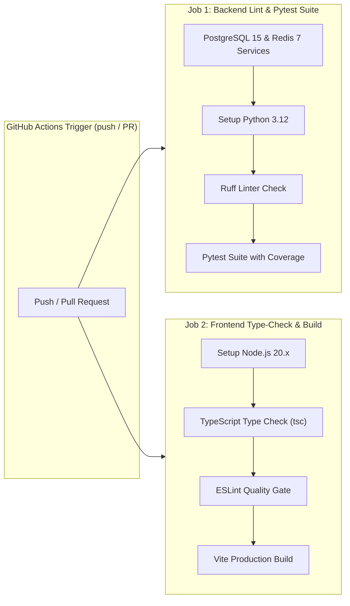

# CloudPulse AI — Testing, Code Quality & CI/CD Pipelines

This document details the testing architecture, static analysis code quality enforcement, security auditing tools, and GitHub Actions CI/CD automation pipelines for **CloudPulse AI**.

---

## 1. Quality Engineering Matrix

CloudPulse AI enforces zero-tolerance quality gates across backend and frontend repositories:

| Quality Gate | Tool / Library | Execution Command | Purpose |
| :--- | :--- | :--- | :--- |
| **Backend Linter** | Ruff | `ruff check backend/app` | Fast Python code quality and import sorting (`py312` target). |
| **Backend Security Audit** | Bandit | `bandit -r backend/app` | Static security scanner for Python vulnerabilities and unsafe code. |
| **Backend Async Test Suite**| Pytest | `pytest backend/tests/ -v` | Async integration & unit testing passing against DB & Redis. |
| **Backend Test Coverage** | Pytest-Cov | `pytest --cov=backend/app` | Code coverage reporting (`term-missing`). |
| **Frontend Type Checking** | TypeScript | `npm run type-check` | Strict compiler checks (`tsc --noEmit`) with zero errors. |
| **Frontend Code Quality** | ESLint | `npm run lint` | Code style enforcement with zero allowed warnings (`--max-warnings 0`). |
| **Frontend Prod Build** | Vite | `npm run build` | Validates optimized production bundle compilation. |

---

## 2. Asynchronous Pytest Test Suite (`backend/tests/`)

The backend test suite contains 51 test files executing over 100 async test cases:

- **Fixture Configuration (`backend/tests/conftest.py`)**: Provides async database session fixtures (`async_session`), mock Redis cache clients, and test JWT authentication headers.
- **Async Execution Mode**: Configured in `backend/pyproject.toml` with `asyncio_mode = "auto"`.

### Running Tests Locally:

```bash
# Navigate to backend directory
cd backend

# Run entire pytest suite
pytest -v

# Run specific test module with coverage
pytest tests/test_auth.py -v --cov=app/api/v1/endpoints/auth.py
```

---

## 3. GitHub Actions CI/CD Pipelines (`.github/workflows/`)

The repository includes three automated GitHub Actions workflows:

### 3.1 Main CI Pipeline (`.github/workflows/ci.yml`)

Triggers on every `push` or `pull_request` targeting `main`, `master`, or `develop` branches.



### 3.2 Docker Build Pipeline (`.github/workflows/docker-build.yml`)
Validates that both `backend/Dockerfile` and `frontend/Dockerfile` build cleanly without caching errors.

### 3.3 Security Scan Pipeline (`.github/workflows/security-scan.yml`)
Executes **Bandit** static security analysis across Python code and scans container base images for known CVE vulnerabilities.
